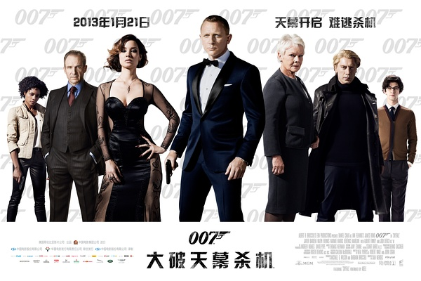

《007：大破天幕杀机 Skyfall》

老公的评论
 
　　其实一直不怎么欣赏丹尼尔·克雷格所扮演的007，觉得他总是多了一些勇猛，而少一些007让人向往的幽默与洒脱。
 

　　这部电影的开头确实很有大片的气势，但是，自从007被自己人“击落”河中之后，我就觉得没意思了，不过，说后面的戏没意思也不够客观，因为我没有看，在军情六处被炸了之后，我基本就处于半梦半醒之间了，少有的看电影的经历。
 
　　清醒了，电影也结束了，所以没有什么发言权。

老婆的评论：
 

　　之前才说完一个好的故事开头很重要，看来要补充了，过程同样很重要，不然，在看的过程中随时都有可能发生像老公那样被这部电影给催眠了。
 

　　这部电影，我只觉得开头那部分好看，打的够激烈，后来的故事，真的好像老太太的裹脚布，又臭又长，看之无味，弃之可惜，生怕这样一部大片在之后的情节中，会有不错的发展。
 

　　不喜欢007的女老板，她的死好像一点都不会刺激我，似乎我认为007去保护她都是多余的，因为这样一个老大，实在得不到人的尊重，自己的手下流血，不要管，就让他死吧。再有007和敌人搏斗中，开枪吧，不要管打着谁，结果就打着了007了，把敌人给放走了。所以也不要怪那个被她放弃过的探员来复仇——因为有仇不报是人渣嘛！
 
　　这部电影加入上海和澳门这些情节也是多余！！
 
上映年份 2013							
		
http://blog.sina.com.cn/s/blog_52187ba901019k8l.html
