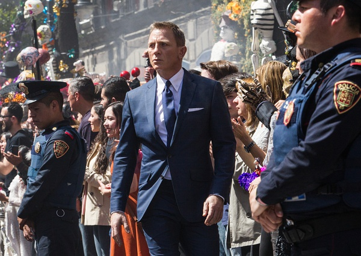

《007：幽灵党 Spectre》

			

老公的评论：

　　在我看过的有关007电影中，毫无疑问这是最难看的一部，我一直在奇怪为什么我们会把这部电影看完，我想多半是品牌的影响力吧，让我总会觉得“后面会精彩一点吧……”！

　　首先克雷格已经老的不像样子了，他在剧中饰演的007也显得很苍老，注意不是沧桑是苍老，面对这样一个角色，我很难认为英国的特工是有效率有能力完成各种任务的。

　　其次电影中的感情戏太夸张了，没来由地就滚床单？难道人类变成了无智商生命，所有的感情都是没有逻辑的吗？

　　再次电影的节奏太慢了，基本无法让我跟着剧情走，而在观看的时候总是开小差，一会儿对比一下我知道的几任007，一会儿挑挑克雷格显得苍老的特写镜头……

　　最后，我想说的是这部电影的复古感并没有拍出来，明明是新时代的电影，非要拍的像冷战时期的环境和感觉，显得有些不伦不类。我一直觉得看电影是要猎奇的，无奇可猎的最终结果，就是我不认为克雷格还有下一部007的戏好拍了。或者，这样的007已经无法再当电影的主角了。

老婆的评论：

　　这部电影没有特点，情节上不能抓住人。

　　故事的推进很慢，主人公邦德（丹尼尔·克雷格饰）为了完成M交代的任务杀了一个黑手党并要求去参加其葬礼，在其遗孀露西亚·斯琪拉得知有一个密会要举行，进而展开调查。

　　故事情节也很平稳，没有特大的起伏。

　　我很不理解有像玛德琳·斯旺（蕾雅·赛杜饰）所在的医院那样，在一个人烟罕见的地方，去看一趟病得花多少精力。

　　我也不理解，那个幽灵党为什么把基地建在沙漠里，要是被发现，一个导弹就能把他们清理了。

　　我更不能理解弗兰兹·奥博豪斯（克里斯托弗·沃尔兹饰）为什么对他爸爸收养的孩子邦德那么大的仇恨。

　　最后我想说的是，我觉得这部电影不好看。

上映年份　2015							
		
http://blog.sina.com.cn/s/blog_52187ba90102wer2.html
