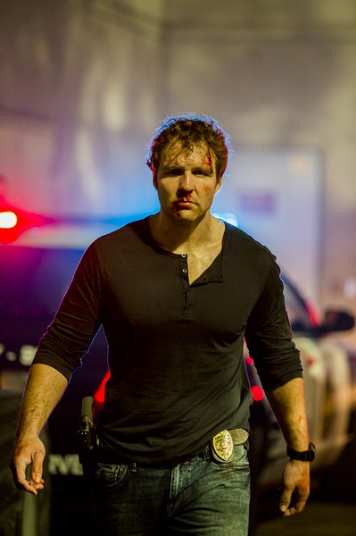

《12回合：致命禁闭 12 Rounds: Lockdown》

			

老公的评论：

　　WWE明星出演的电影，即使不是太大的制作，但因为走的是动作路线，总是很爆米花的！

　　迪安·安布罗斯在片中的形象非常颓废，一点都不像一个三十岁的人，看着就像已过了不惑之年的大叔，话说为什么WWE明星在拍电影的时候都显得比实际年龄要老一些……？

　　这次故事里的12是12颗子弹吗？肖警探放弃了很多拿到重武器的机会而依然每次都要通过自己的手枪完成战斗实在是太有趣了，显得这个角色头脑是真的有点问题。

　　电影的结尾有一点做作，肖可是中了两枪，就那么耍帅地走出去……，酷是酷，但……

　　依旧觉得WWE明星的电影比漫威大部分电影好看。

老婆的评论：

　　整体上我觉得这部电影还挺好看的。

　　虽然我不太喜欢肖恩处理敌人的那种方式，我特别的奇怪他的思维是怎么形成的？难道只是因为编剧想把这部电影叫着12回合，所以，非要给他安排他有12颗子弹，然后每一个回合用一颗子弹。在我看来，非常的不合逻辑。人在那种环境下，对付敌人，有更强的武器为什么不用？还有不是应该杀绝了才好嘛？为什么几次肖恩都放过对手，最后不是还得杀了？

　　另外一个，在看的时候，我就很怀疑他们的女上司，在接到肖恩的电话时，为什么不和指挥的领导说清楚，最后揭穿啊，原来她也是黑警啊。

　　最后，我要说一下，肖恩是挺厉害的，在一个小环境里别那么多的同事追杀还能活着已经不错，最后还能录音证明自己的清白。

上映年份　2015							
		
http://blog.sina.com.cn/s/blog_52187ba90102wfve.html
