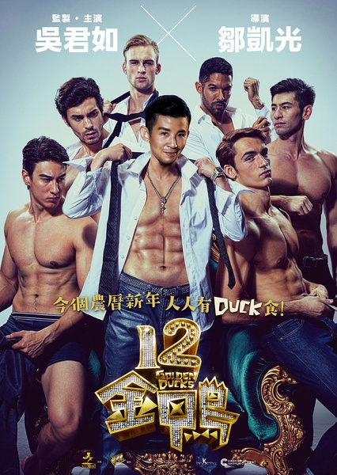
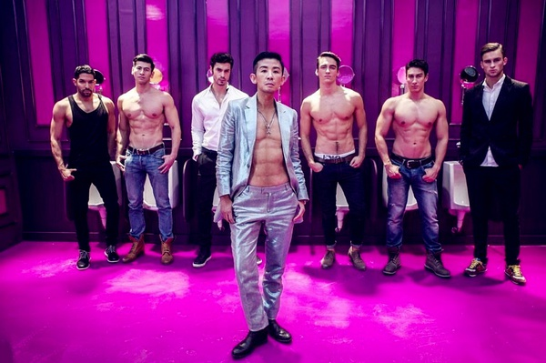
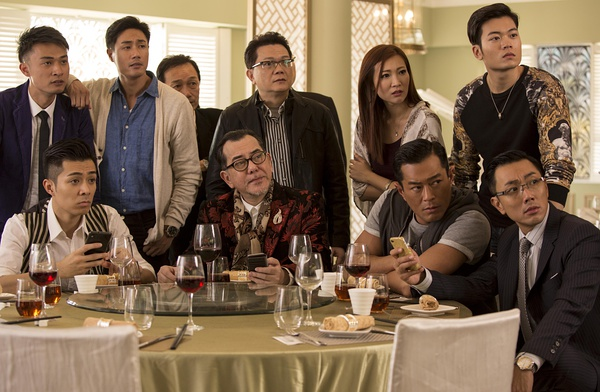

《12金鸭》

			

老公的评论：

　　虽然是讲“鸭子”的电影，但是挺温馨，也挺励志的……

　　吴君如的反串实在是挺有意思的，而且演的是头牌金鸭，实在是太逗了，本身就像周星驰要出演琼瑶片男主角一样很有喜剧效果。不过吴君如真的好瘦啊，身材保持的真好。想想她当年，也是混玉女圈的……

　　黄秋生、古天乐、谢霆锋、赵薇、鹿晗……，太多的人在这部电影中客串，让我以为这部电影是贺岁片了，到底是不是呢？

　　一部喜剧电影，喜欢港片的朋友不妨看看，别期待有什么情色场面，就是看个脸儿熟……

老婆的评论：

　　这应该是一部贺岁片，不管剧情如何，出场的电影明星到是真多。

　　吴君如在本片总反串男角张近莱，这不得不赞现在的化妆技术，还能做到敞胸露怀呢。但其实，我个人觉得，这种反串实在是没有必要。

　　这部电影里的男人，都不是特正常的，就算你是服务于女性，也不需显得如此的……，实在没找到合适的词来形容。

　　主角张近莱本是女见女爱的万女迷的人物，却在感情上被人欺骗，过着颓废的日子，在鲁老师的激励下，要在鸭界重振雄风，于是有了这部电影。
　　
　　妓女也好，鸭也好，都会有人去捧场的。所以说，好色并不是男人的专用标签。

上映年份　2015							
		
http://blog.sina.com.cn/s/blog_52187ba90102wfvf.html
