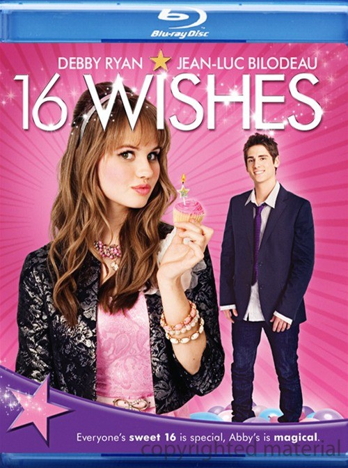

《16个愿望 16 Wishes》

			

老公的评论：
 

　　否定了《勇敢的人》、《女巫季节》、《武装女猎人》三部电影之后，终于碰到了这部值得一看的《16个愿望》，现在的电影质量良莠不齐，导致我们更喜欢看连续剧了，因为我们可以通过一两集好看不好看，就可以确定我们可以观看一季或者是几季，不像电影，可能看了无数个开头，但没有一个好看的。
 

　　回到主题，《16个愿望》从表面看来，像是一部青春励志片，实际上当然它也是一部青春励志片，我觉得这部电影好，有两个原因，一是它的起承转合、抑扬顿挫都很恰当，二是在不同的年纪看来，对这部电影可能会有不同的感受。
 

　　这个故事是个神话故事，主人公得到了一套神奇的生日蜡烛，可以帮助她实现她的生日愿望，本来我以为这只是一个搞笑的儿童片的，但是在Debby许下了那个“不想让人们再把她当成小屁孩”的愿望的时候，故事发生了转折，Debby终于知道了自己当初所追求的很多东西可能都是不争取的，于是，仙女给了她重新选择的机会，在重新回到生日当天开始的时候，Debby做出了完全不同的选择，她最快乐的生日出现了。电影当中的那个转折很恰当，也让人觉得很有趣——不可能事事都是那么顺心的。
 

　　我早就不再是个中学生了，也不需要励志，但我看这部电影的时候，却能完完全全地体会到那种属于年轻人的快乐，那种没有工作压力，没有贷款，没有复杂的人际关系的快乐。
 

　　忽然想起来，长大之后，每个生日都是会和父母一起过的，好久没有找一帮朋友热闹一下了，下次老婆大人过生日的时候，可以好好地操办一下。
 
　　快乐是永远的家……

老婆的评论：
 
　　虽说这是一部比较幼稚的电影，我们还是看的很高兴的，整部影片还是挺有看头的。
 

　　曾幻想过有一天，我打开了神灯，他让我许三个愿望？我应该要什么呢？想想自己也很贪心，想要身体健康，感情美满，还想要有很多的钱，比起本片的主人公Debby来说，我真的很市侩。她的愿望多简单，见某明星一面，有漂亮的衣服，就这样最终她想要的只不过，回到许愿前的那一刻。或许，当我知道许愿之后的一切都有很多的变数，我也只希望维持现况。
 
　　在看电影时，和老公一致认为本片的男主人公Jay是一个非常帅的帅哥。没想再过一会看的《非凡家庭》中又看到他了。
上映年份
2010							
		
http://blog.sina.com.cn/s/blog_52187ba90100vgt0.html
