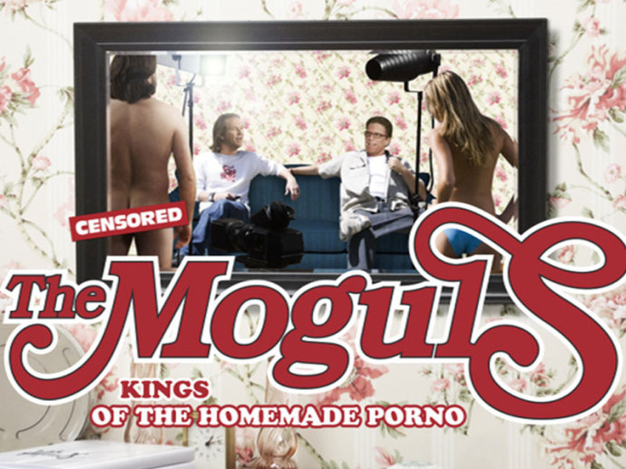
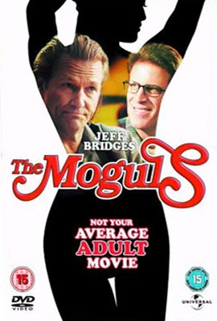

《A片特工队 The Moguls》

			【夫妻影评】《A片特工队 The Moguls》

老公的评论：
 

　　最近看的电影比较少，一直在看着各国的连续剧，因为新买了一个55英寸的大电视，想找两部电影来试一下，就选择了《卡布里卡》和这部《A片特工队》，卡布里卡我们坚持着看完了，但实在是没什么感觉，可能是不大知道故事的来龙去脉吧，觉得整部片子的气氛很压抑，也没有什么值得称赞的特效或创意，而《A片特工队》我则觉得是一部不可多得的温馨影片。
 

　　可能很多朋友会被这个名字所误导，我想这也算是一种噱头吧，电影中讲述的确是是和拍摄A片有关的故事，但讲述的却是一种友谊和成功，用老婆的话讲，这是一部很另类的励志片。
 

　　电影中虽然有一些可能是“少儿不宜”的对白，但已经被那种浓郁的喜剧气氛给淡化了，而且，从画面上来看，并没有什么很暴露的镜头，这点和难得，特别是到了最后，当剧中的主人公制片人悟出了真谛，知道拍一部怎样的电影才会被欢迎的时候，那是一种扑面而来，甚至是让满室生香的温馨。
 

　　一个不大的镇子，一伙儿看上去也不是很有学问的人，就这样获得了成功，这给人的感觉很好，真的，我想如果有机会的话，可能每个男人都希望有这样一些朋友可以一起创业，一起获得成功。
 
　　在奋斗着的兄弟们，加油，一起努力啊！
 

 
老婆的评论：
 

　　这种影片刚开始看的时候不喜欢，有点乱，中间的情节，让我对这些主人公很是着急，钱都快花完了，Ａ片还没拍出来，怎么办？可是问题还是挺多挺多的，好不容易拍出了一些东西，又不能用，但就这样一群很穷的小人物，却在金钱与友谊的中，选择了友谊。最后的结局却不错，影片出名了，他们也有钱了，是一部不错的励志片。
 

　　影片的过程有点意思，主人公因为儿子过生日买了一个廉价的篮球，到了前妻家，看见儿子的篮球很多很多，他那个假“乔丹”签名的篮球最终也没拿出来，于是回去想怎么赚钱，在综合种种觉得拍Ａ片最赚钱了，于是发动酒吧中的那几个朋友一起投资拍Ａ片，就这么一点点的集资，等到拍摄的时候，又发现演员场地都是问题，等终于又一场片子拍完了，又会出现问题，解决这些问题的时候，同时也让他们的友谊更好了，最后影片获得了成功，他们都有钱了，都挺快乐。
 
　　不过电影中的男人们都长的太丑，可能这样更像现实吧。

上映年份 2005
 
部分演员职员表
导演……Michael Traeger
Andy……Jeff Bridges
Barney……Tim Blake Nelson
Idiot……Joe Pantoliano
Otis……William Fichtner
Moose……Ted Danson
（因为最近访问不了IMDB了，所以查找很多电影的演员有些困难，这部分可能没有以前精致了，大家原谅）							
		
http://blog.sina.com.cn/s/blog_52187ba90100gehe.html
