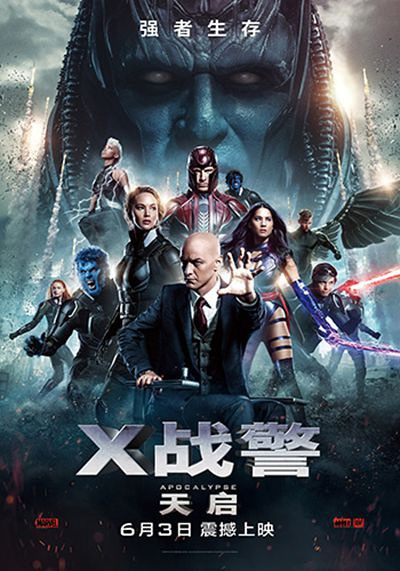
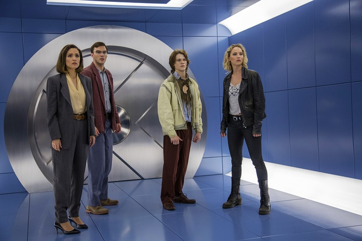
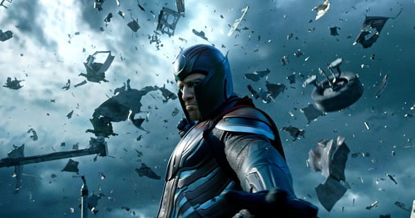

《X战警：天启 X-Men: Apocalypse》

			

老公的评论：

　　在我看来，这部电影前面铺垫了那么多的剧情都是无效的，关于X战警的基础概念已经建立起来了，所以，对于我，看这个系列的电影看的不是剧情，而是场面。

　　从天启一出现，我就感觉最后教授和万磁王会联手对付他，所以前边对于天启的那些描述都是没什么作用的，甚至是关于万磁王的遭遇，激光眼的入校对我来说都不是看点，整部电影的进行期间，我一直在等待，等待战斗的大场面！

　　应该说，最后的战斗还是做的不错的，无论是从特效方面还是情节设计方面，其中天启一面在现实世界和变种人战斗一面在心灵世界战斗的设计还是有些想法的，而且表达的很清楚，看着不会混乱。

　　对于剧中演员的话，我觉得麦卡沃伊的扮相越来越有魅力了，特别是他有头发的时候……

　　看这种电影，知道正方和反方一定会有大对决，一定会是正义的一方获胜，所以，应该打的再激烈一些，其他的真的不是那么重要！

老婆的评论：

　　电影的前期节奏真的太慢，而且一个个出场占的时间比例太大，导致刚开始的故事没情节，感觉上东一下西一下，让我好几次都要失去耐心了，直到大战才有的看。

　　一直觉得这部电影有种熟悉感，或许我一起看过一次了，具体的内容已经忘记了。

　　没想到最厉害的人是琴，没有琴的话，估计其他人就要被那个变种人天启给打败了，他的出现和后期改造的变异人再到要打败教授都让我觉得他才是最厉害的。

　　这些人物形象大家都应该很熟悉了，不需要最赘述了。

上映年份：2016
							
		
http://blog.sina.com.cn/s/blog_52187ba90102x0s6.html
