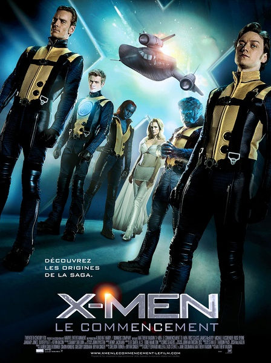

《X战警：第一战 X-Men: First Class》

			老公的评论：
 
　　漫画英雄类型的电影，是老婆大人喜欢的，我则一般一些。
 

　　看这部电影，我从中获得的最大的收获，是编剧对于整个《X战警》系列电影故事完整性的把握，我没看过原著的漫画，所以，当我看到这部电影把万磁王和X教授设定为朋友的时候，多少有些想法，想看看他们最后如何反目成仇的。这一点我认为剧情设计的还是挺合理的，两个人最后并没有成为仇敌，只是选择了不同的政治立场。
 

　　在故事里，金刚狼还出来客串了一下，挺有意思的，毕竟我是从金刚狼整个角色才了解《X战警》的故事的，加这么一个小细节，让我觉得很亲切。
 

　　电影中的红魔鬼很酷，据说原著中什么撒旦、路西法都是他的化名，只是，不知道力量如此强大的他为什么要为别人卖命呢？自己当老大不好吗？
 
　　对比那么多的超能力人物，电影中那位女FBI显得单薄了一些，故事里有没有她好像都没有关系。
 
　　对了，这部电影还选择了前苏联在古巴部署导弹这一题材，喜欢政治和军事的朋友不妨把这当做一段野史来看吧！

 
老婆的评论：
 

　　又是一部类似前传的影片，解释了一下万磁王和X教授之前是朋友，因追求不同，最后分开的故事。整体来说，我不是很喜欢这种拍了后面再拍之前的影片，我理解像X战警这样一部影片能到火的状态不容易，拍前拍后能省了很多的宣传成本。但这部电影整体来讲却点什么……
 
　　再说回电影本身，我觉得一部科幻电影没必要和政治联系在一起，或许只是说明肖很坏而已。
 

　　我不是很能理解魔形女为什么要和万磁王在一起，她从小和X教授查尔斯在一起，在那种情况下无论如何很难做出这种决定的。当然所有的变异人，我最讨厌她那样的，变成别人的样子，没什么意思。
 
　　个人觉得红魔人阿扎赛尔很厉害，瞬间移动很棒。
 
上映年份
2011
主演
詹姆斯·麦卡沃伊
迈克尔·法斯宾
凯文·贝肯							
		
http://blog.sina.com.cn/s/blog_52187ba90100vnxb.html
