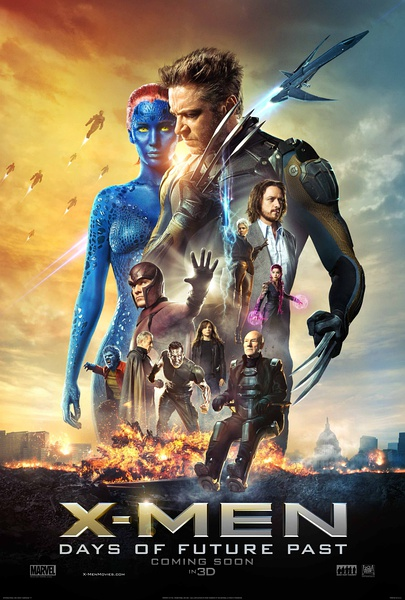
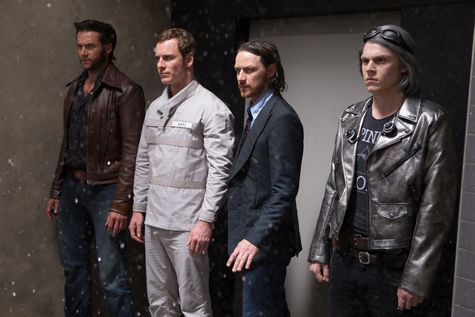
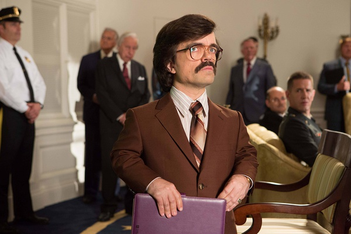

《X战警：逆转未来 X-Men: Days of Future Past》

			

 
老公的评论：
 

　　我觉得《X战警》再这么拍下去，不如改拍剧集吧，那样会把背景材料制作的更细腻一些，让我们这些观众可以更深入的去了解每一个角色。
 

　　虽然这部剧集属于那种“回到过去，改变历史”的故事，但是并没有涉及太多的时空理论，这样也对，本来X战警们已经够科幻的了，没必要再找出更多的科幻题材了，已经穿越到过去了，没必要非得在未来形成一个平行世界（虽然这个题材现在很泛滥）。
 

　　狼人还是这个故事的主角，最主要的原因是他的不死之身，呵呵，可是后来他被固定在水下，让我觉得很凄惨，忽然想起了“火炬木小组”的杰克上校，被埋在了地下，每次复活之后马上死亡——还有什么比这个更残酷的？
 

　　《逆转未来》似乎在告诉我们《X战警》后续作品的走向：万磁王依旧是坏蛋，教授不会真的“吸毒”上瘾，每个角色的生生死死并不是绝对的，在某个特定的剧情里，任何角色都有可能为剧情牺牲，任何角色也都有可能为剧情而重生，看吧。
 

　　如果拿《明日边缘》来做比较的话，《逆转未来》是要输了很多的，但这并不应该是否定《逆转未来》的理由，可以看，但是不必过分期待。
 
　　最后说一下，范冰冰扮演的角色，很有“大力开发中国市场”的嫌疑。

 
老婆的评论：
 

　　不是有种理论即使你回到过去也改不了现在吗？反正也没有关系了，这部电影回到过去是可以改变未来，那要有金刚狼那样身体，回到过去，还有一个金刚狼，现在世界金刚狼身体还在。
 
　　现在世界的变种人很快就要被玻利瓦尔·特拉斯克博士制造的“哨兵”消灭了，X教授和万磁王决定要金刚狼回到过去改变未来。
 

　　选择改变了未来，在万磁王要消灭总统等众人时，X教授终于说服了“魔形女”瑞文，她没有让万磁王杀死总统等人，而她自己没有杀死博士，一切因为这个选择未来改变了。
 
　　醒来的金刚狼发现，学校还在，好多过去死了的朋友也在，这一切很神奇。

她的DNA真的很重要，可以毁灭变性人，改变世界。

某种意义上，我非常的不喜欢这种怪博士，对地球而言，他们既是希望也是毁灭!

上映年份 2014							
		
http://blog.sina.com.cn/s/blog_52187ba90102v7w9.html
