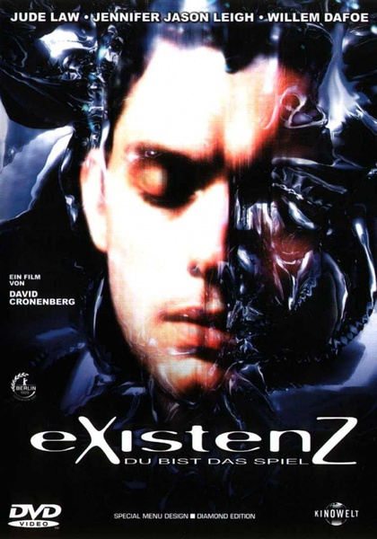

《X接触 eXistenZ》

			

老公的评论：
 
　　之前并没有看过这部轰动一时的电影，应该说它的出现让很多的中国科幻小说“作家”有了灵感。
 

　　从科幻的角度来说，《X接触》是一部真的很不错的好电影，在上个世纪末期，很多现在的“资深”网民还没有用过网络，但是美国的电影中已经把网络游戏发展到了虚拟现实……，我真的无法想象如果我在第一时间看到这部电影会有什么样的感受。
 

　　裘德·洛那个时候还显得很青涩，电影中的血腥场景还显得很恶心，从今天的角度来看，里面的特效也没有什么值得夸耀的，但是，这部电影让我很认真地看完了，能看完，就说明这部电影对我这个科幻迷来说是有可看性的。
 

　　虽然我已经无法知道当年看到这部电影的感觉，但我却可以想象如果现在拍这样的题材会拍成什么样——因为很多电影已经拍过了，呵呵！
 
　　其实我觉得这个故事还有很多可以挖掘的题材，应该拍成一个剧集，单是里面的各种小怪物就挺有趣的。

老婆的评论：
 
　　没想到这么老的影片还能看。很科幻！游戏是由人的意识构建出来的。一群人在一个意识群里，各自构建角色，我理解的对吗？
 

　　在现在看来，这样的游戏也很让人向往，不过，要是真往我身上钻个洞才能玩，那么我可不敢玩，非常的不安全。要是只是戴个头盔，还可以考虑，这种游戏应该像似毒品，一旦喜欢上了，可能真不愿意回到现实世界，多有意思的世界。
 
　　到最后我也不知道到底哪一个是现实世界？哪一个是游戏世界？不知道主人公们是否分清楚了。
 
　　整部电影的在创意方面还可以，但拍摄方面还是可以更好，有的方面我还有点看不懂，不知道大家是否有这种感觉。

上映年份 1999							
		
http://blog.sina.com.cn/s/blog_52187ba90101hff1.html
