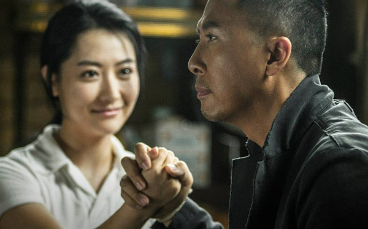

《一个人的武林》

			

老公的评论：

　　很打的一部电影！真的没想到王宝强参演的电影会有这么一部让我觉得很好看的。

　　说好看，当然不是因为王宝强，毕竟他是一位谐星，而且是中国大陆式的谐星，但是电影中的武打场面确实过瘾，而且甄子丹的演出越来越有范儿了，他在影片中表现出的那种淡定的感觉真的很像是一代宗师了。

　　这个故事有一个小小的瑕疵——难道中国的武术高手都集中在香港了？可是为了案情的集中，又没办法不这么设定，一个没办法的硬伤。

　　很久没看到方中信的银幕角色了，还有樊少皇，感觉方中信还是那么有味道，而樊少皇英俊了很多，而且因为和王宝强有对打的戏，显得樊少皇还很高大。

　　因为有王宝强，怕无厘头的有些过，所以这部14年的电影被拖到了15年年末才看，后悔看的有些晚了。

　　港式动作片的新代表作之一，特别是片尾对香港动作片的怀旧，让人很是唏嘘。

老婆的评论：

　　一个人的武林，那得多寂寞，看到这部电影名称时，我是这么想的。

　　人在这个世界真的好渺小，就算在这个信息爆炸的时代，我也不知道，地球上还有这么多奇奇怪怪的事情，就说那武林的世界，离我就很遥远，可这也是存在的。

　　夏侯武（甄子丹饰）是武痴的话，那么封于修（王宝强饰）就是变态的武痴，既分高下，也决生死！所以他要挑战的对手输了的只能是死，当然也是为了刺激夏侯武。

　　封于修的连环杀人案，警局不得不重视，最终也逼的夏侯武不得不出手，在高速上的那段打斗，还是不错的，事实也证明了，最厉害的武术没有枪快，封于修死在了警察陈玄心（杨采妮饰）的枪下。

　　甄子丹这些年越来越有宗师的感觉了，他的一举一动很有大师的味道。

王宝强在这部电影里演的不错

上映年份　2014							
		
http://blog.sina.com.cn/s/blog_52187ba90102w7l0.html
