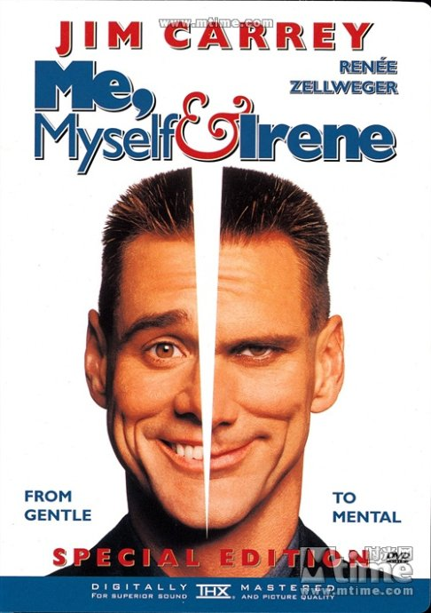

《一个头两个大 Me, Myself & Irene》

			

老公的评论：
 

　　这是一部老电影，我们看，是因为对金·凯瑞的喜爱，不过看来“每一部没看过的电影都是新电影”这句话并不适合用在这里，这部电影，在十多年前或许还不错，但现在看来，确实是有一点过气了。
 

　　笑料粗俗是这部电影不够顶级的一个原因，实际上电影中的很多笑料在现在看来已经不可笑了，不过我觉得会让我记得一点是“小白”在床上聊天说自己是个变态杀人魔王的那段，还算不是不错，配合下文说他以为主人公是个精神病兼通缉犯才编造自己的历史，算是一个笑点吧。
 
　　金·凯瑞在那个年代的电影，其实更多的就是看他一个人耍宝就够了，算是一种怀念吧。
 

　　从金·凯瑞想到了周星驰，他们两个都可以算是戏剧界的怪才了，可惜他们的风格并没有延续下来，对他们来说可能是一直在突破自己，但对于我这样喜欢看他们电影的人来说，就只能是怀念了……
 
老婆的评论：
 
　　金凯利的影片我只记得《变相怪杰》这部，感觉上还是有点意思。而这部呢，我看着有点犯困。
 
　　不可否认的是，电影的确有点冷幽默，比如金凯利与妻子明明都是白人，生下了三个黑孩子，而他妻子为了一个黑侏儒抛弃了他。
 

　　人格分裂真的很可怕，就如金凯利在这部影片里的两个人格，一个面的不行，另一个为了保护自己而暴力的不行。其实，电影真正的看头也在此了，金凯利把这两个人格演绎的很不同。
 
　　遇到演《Monk》里面演monk的私人助理拉塔莉，很亲切。
 
上映年份:2000							
		
http://blog.sina.com.cn/s/blog_52187ba901012pox.html
