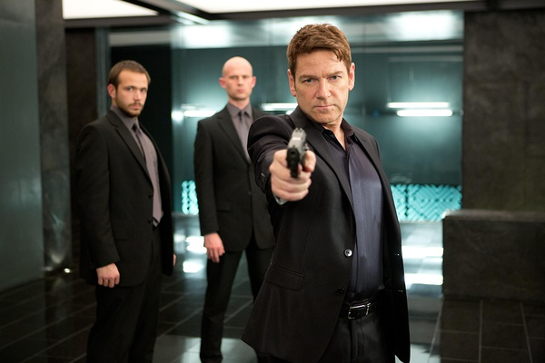

《一触即发 Jack Ryan: Shadow Recruit》

			

老公的评论：

　　看主演的小哥儿很顺眼，查过才知道他演过一部我们喜欢的喜剧《情敌大战》，那也算是一部另类的谍战片了。

　　搞不懂这部电影为什么被翻译成《一触即发》，我觉得抄老港片的名字《间谍出更》也比《一触即发》要形象多了。

　　像这种谍战电影，结局是可以想象到的，所以重点是看它的过程设计的有多突兀而合理，当然，紧张之余笑点也很重要。这部电影给我的突兀的感觉来自于主人公初到俄罗斯被迎接的司机枪机的事件，发生的很突然，也就显得紧张激烈起来了。

　　在看电影的时候，我和老婆大人谈到了“为什么俄罗斯不拍去美国捣蛋的电影，而美国总拍去俄罗斯捣蛋的电影”的话题，觉得是个有意思的潜在题材，美国的文艺作品中也曾经黑过中国很多次，为什么中国不拍反过来类似题材的美国电影呢？

　　电影的男主演克里斯·派恩与女主演凯拉·奈特莉都还算是有型儿的，不知道会不会因为这部电影拍成一个系列而大红起来，不过感觉也挺难的，这部电影要是想拍成一个系列，还需要多一些动作元素，那样场面才更好看。

老婆的评论：

　　现在战争已经不再只是军事上的战争了，军事上的战争在我看来还是为了资源的掠夺，真正的战场已经转移到经济上，就如本片这样，想着利用如何金融产品搞垮一个国家。

　　杰克入伍后意外受伤，被军情局看上，当了经济分析师，发现俄罗斯一个公司的经济异常，他向上汇报，被派去俄罗斯查看。

　　在俄罗斯发生一些意外，他的女友因他的异常行为，直接到俄罗斯找他了，差点出意外了，还好最后没事。

　　在之后的表现中，杰克真的是一个有天赋的人，他面对那么凌乱的画面，居然能分析对方要通过恐怕袭击再抛售股票到达美元贬值达到真正的目的，也分析对方在哪个地方放炸弹，又被他盯上，从而把一场一触即发的战争化解了，真的很厉害。

他们这个时候没想到有一天会相爱吧？！

上映年份 2014							
		
http://blog.sina.com.cn/s/blog_52187ba90102vpe6.html
