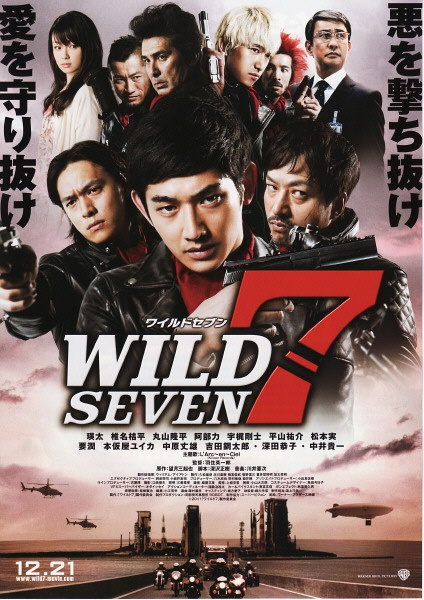
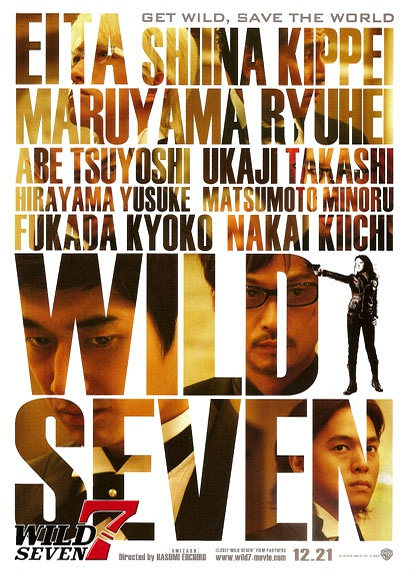

《七金刚》

			

老公的评论：
 
　　日本电影看得很少很少，这部《七金刚》算不上多精彩，但是其中还是有一些可看的地方。
 
　　我和老婆大人都比较喜欢以暴制暴的，这一点让我们觉得“好人”可以不被拘束于法律，而去做道义上快意恩仇，挺过瘾的。
 
　　有点出乎意料的是这次的“地下法官”是官办的，这个细节处理和别的影视作品有些不同，不错。
 
　　不知道国产片什么时候能有类似风格的，即使是在港片之中，这种感觉的也越来越少了。

老婆的评论：
 
　　整体来说，这部电影还是不错的。意境不错！
 

　　刚开始我以为这七金刚是地下判官之类，随着电影的推进，我以为他们要变成地下组织，转来转去最后还是警察的特别部门，要做的事情就是制裁那些法律不能制裁的犯罪，一点都不需要留情，也无需再给他第二次机会，青蛙背蝎子过河告诉我们，他们本性难移。
 

　　随着科技的发展，到处是摄像头，人被监视着没什么秘密了，掌握这些秘密的人自然有着不一样的想法，本片PUB部门的桐生就为了一己之利，变成了一个骄傲的坏蛋。七金刚为了杀了他，冲进了PUB总部，与大批的警察打起来，可是他们的命令是只准杀桐生，这个场面还是很壮观的。
 
　　而那七金刚起着摩托车也非常的耍酷。
 
上映年份：2011							
		
http://blog.sina.com.cn/s/blog_52187ba901014uxa.html
