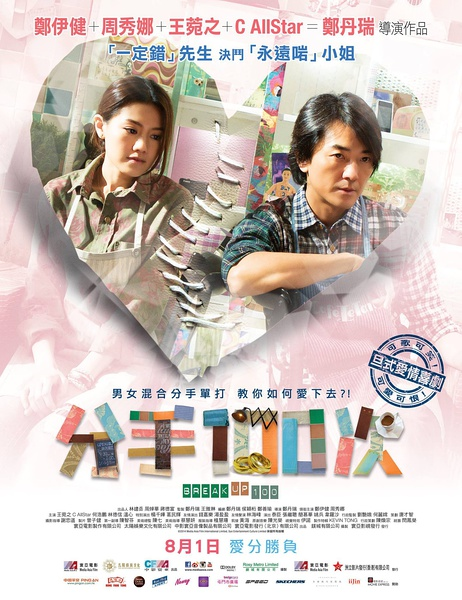
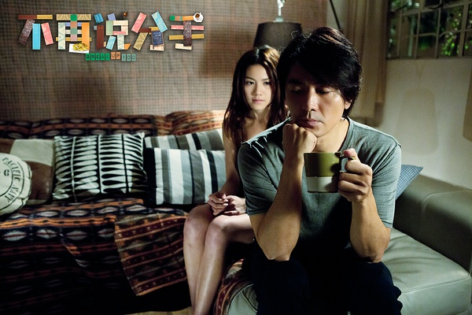

《不再说分手》

			

老公的评论：

　　看这部电影的第一感觉是真实，第二感觉是细腻。

　　我愿意把这部电影归类为“疗伤系”电影，这也是我要说它的真实感所在。其实无所谓男性女性，在现实的情侣当中，总有一个人会扮演小岚这样的角色，事事喜欢拿主意，喜欢把自己的意愿强加于对方……，而郑伊健所扮演阿森也很常见——不善于沟通，能忍则忍，到实在忍不住的时候，通常也就无法挽回了。

　　说它疗伤，其实是觉得大多数情侣会在电影中看到自己的影子，也许这部电影会让很多很多人看到自己的问题，知道一段感情是需要经营的，而不是靠激情来维系！

　　说它细腻，则是因为这部电影的主题很简单，两个字——爱情，但是故事中并没有什么大道理，反而是通过一个一个的小细节来完成对整个气氛的烘托，很精彩，很棒。

　　郑伊健显得年轻一些，而周秀娜则显得成熟一些，一点看不出这两个演员差了快20岁……，看着郑伊健从年轻到变老，唉，白衣苍狗啊！

　　哈，不过高兴地说，这部电影对我和老婆大人来说不算是疗伤系的，因为我们根本没有这些矛盾。

　　故事中的咖啡店很有创意，但是现实中似乎很难开这么一家，太做作了！

老婆的评论：

　　“原来最让我痛苦的不是你要离开我，而是我不知道怎么再爱你。”本片的主人公阿森（郑伊健饰）最后对待爱人小岚（周秀娜饰）的心态。两个相爱的人走到这一步，也算是悲哀的，看结局时，我看他们俩渐行渐远而后小岚又追上了阿森，只是他们爱情是否能圆满，估计也难回当初了。

　　老公一直和我说，要给对方的是对方想要的，而不是你想给的，我想这个是现在大多人都不太懂的吧。

　　额，我觉得分手咖啡迷你仓这个概念不错，但我又想，这个概念可能在中国很多城市又不太行的通，谁每个月为已分手对方的礼物租地方呢。

　　这部电影，我觉得值得一看，尤其是这些有感情问题的恋人们，看看他们反思自己。

上映年份　2014							
		
http://blog.sina.com.cn/s/blog_52187ba90102wgiu.html
