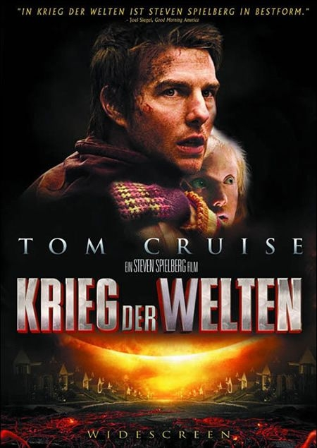

《世界大战 War of the Worlds》

			【夫妻影评】《世界大战 War of the Worlds》

老公的评论：
 
　　我喜欢看科幻小说，喜欢看好的科幻小说，所以我非常喜欢威尔斯，选择这部电影，是因为我知道这部电影的原创是威尔斯。
 

　　不知道是不是我们看的版本有问题，我看这部电影的结尾显得很仓促，没有交代清楚，那些外星人就钙化了，也许不是钙化，反正是变成白色的粉末了。
 

　　相对于科幻片而言，我觉得这部电影是灾难片，而我是最讨厌看灾难片的，在这部电影当中，我不喜欢的是小女主人公，也不喜欢那种只有西方人才会接受的父子关系，我觉得对表现主题没有丝毫的帮助。
 

　　时间如果回到2005年的话，这部电影应该算部大片吧。里面的场景设计的很酷，而且关于外星怪物的特技也很不错，看不出太多斧凿的痕迹。
 
　　今天，翻拍的故事也太多了，威尔斯一百多年的作品，要想在找到当年的感觉已经很难了，大导演、大明星，更需要好的编剧啊！
 
老婆的评论：
 
　　这是一部讲一家人在外星人入侵地球的逃生记，过程是惊险的，结果有点仓促，外星人死的太突然。
 

　　你担心外星人入侵地球吗？想知道如何躲避这种危险吗？看看这部影片你可能就有所想法了。老公总结了一个办法，要是外星人真来了，躲一个超市里，有很多吃的，等外星人在地球呆一段时间，他们受不了地球上的各种细菌死了，我们再出来就行了。这个方法说出来了，大家都这样想的话，那人类争夺超市大战又可以拍一部电影了。
 

　　这部电影是威尔斯的作品改编成的，想想这个威尔斯太厉害了，100年前就能写出这样的小说。关于威尔斯，看《第十三号仓库》时，影片还说威尔斯实际上是一个女的，哈哈，有意思！其实男的女的有什么关系，我现在还看他的作品呢。
 
　　这部影片的各种场面还是挺惊险的，场面也够大，影片还是挺好看的，演员方面我很喜欢汤姆克鲁斯。
 
上映年份
2005							
		
http://blog.sina.com.cn/s/blog_52187ba90100nicu.html
