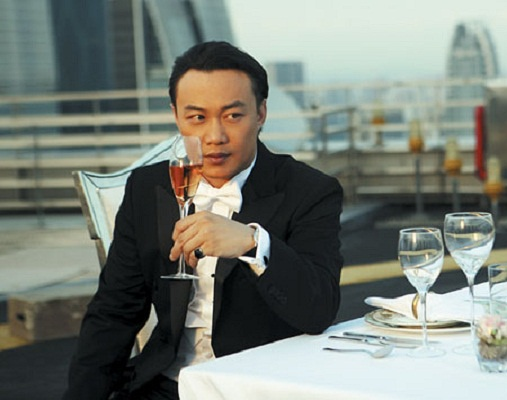

《东成西就2011》

			

老公的评论：
 

　　很多批评这部电影的言论是缘于《东成西就》，这似乎有点不公平，那部是经典，而且那个年代人们的欣赏水平也和现在有很大的不同。
 

　　温拿乐队在大陆的影响力没有那么大，除了谭咏麟和钟镇涛，恐怕并不是什么歌迷都知道温拿其他成员的，这让整个电影的脉络有些失色。
 
　　我虽然很喜欢灵异神化的电影、电视剧，但是这部电影的转变有点太快了，突然由都市剧情变成了魔幻剧情，很厉害。
 
　　陈奕迅饰演的周冲在由好变坏的一瞬间还是挺有感觉的，铺垫的很成功。
 
　　不得不说的一点是现在的艺人太多了，明星也太多了，这部电影有那么多的明星出场，我却没有认出几个。
 
　　明星多了，粉丝很自然的就会分流，只能说，这是一个不容易产生巨星的年代了！

老婆的评论：
 
　　这样一部电影，看的我实在是无语。不过影片的后面这部分还是挺提气的。
 
　　一堆的角色，一堆的主演，这么多的明星演出了一场很热闹的剧，也算是一种风格吧。
 
　　客观的说，我不喜欢这部电影。

上映年份　2011							
		
http://blog.sina.com.cn/s/blog_52187ba90101eovr.html
