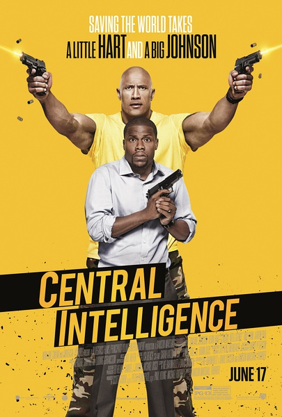
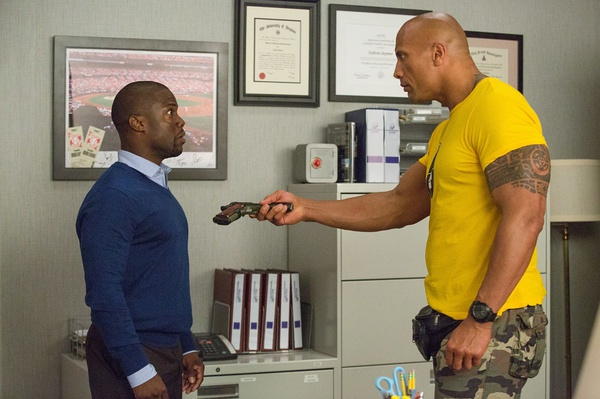

《乌龙特工 Central Intelligence》

			

老公的评论：

　　这是我们近期看过的最好看的电影。

　　巨石强森一直是我们最喜爱的动作明星之一，他在这部电影之中虽然略显老态，但是笑容真的很阳光，还略略地带着一点憨气，很像这个角色的小时候。

　　凯文·哈特算是这几年我们还能接受的喜剧明星，真的很难想象个子这么矮的他能够成为影星，看来外表虽然重要，才华也同样重要啊。

　　电影情节的设计也是很有意思的，直到鲍勃的特工搭档出来才让我们知道谁是真正的反派……

　　很能理解电影中鲍勃对金色喷气机的崇拜，哈哈，因为从小长大，我总是很容易成为被崇拜的那个……，觉得剧中的两个人物的感觉很像我和华少……。

　　剧中的强森向哈特说“你简直就是黑人版的威尔·史密斯”实在太逗了……。同时代的影星们再老去，希望能多看到强森的好电影。

老婆的评论：

　　这部电影还是挺搞笑的，只要想要大块头强森，在凯文哈特小块门前演的像一只小绵羊，就很好笑。

　　可能是因为在学校鲍勃（道恩·强森饰）被人欺负惯了，在后来他当上特工，身材变得特别好，他也被自己当初胖子懦弱的心理影响，所以他一直佩服当初的校园明星卡尔文（凯文·哈特饰），虽然再见面是卡尔文只是一个会计师。

　　看电影的时候，我一直幻想，鲍勃心里有一份黑名单，现在他有能力了，正要磨枪来报复那些曾经欺负过他的人，当他和卡尔文一起见那个同学，看着他诚恳的道歉，我想那个人可以去掉了，哈哈，事实上并不是那么回事啊。

　　鲍勃遭到陷害，在卡尔文的帮助下，总算还原了真相。而卡尔文通过一系列事情发现妻子才是最重要，和妻子生一个孩子圆满了。

　　在20年的同学返校节上，鲍勃克服了自己的心理障碍。皆大欢喜！

上映年份：2016							
		
http://blog.sina.com.cn/s/blog_52187ba90102x18u.html
