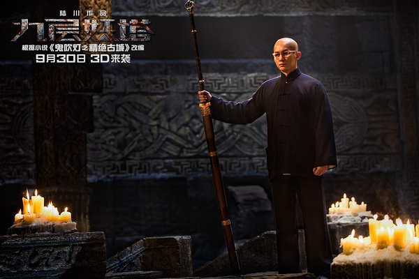

《九层妖塔》

			

老公的评论：
 

　　一直是不怎么打算看姚晨的电影的，因为觉得她长得好丑……，而赵又廷呢，我又觉得他长得好土，本来觉得这两个人演的片子我是不会看的……，再加上又不是某部网络小说（一直分不清楚也没看过鬼吹灯还是盗墓笔记）的书迷，所以这部电影虽然已经出品了好久，但是一直都没有看。
 
　　因为假期有点时间，终于一起看了这部电影，说老实话，我觉得这部电影的世界观还是很有看点的。
 

　　毕竟人族和魔族的战争是一个很能引发视觉感联想的话题，光是听着这个题材就很有意思了，再加上故事里还有什么守陵人啊，还有各种魔族怪兽啊……，另外动画特效也不错，我觉得中国的魔幻题材能拍到这样，算是可以了，当然，小镇和怪兽枪战的那一大段戏很一般，从内容和手法上还是显得导演、编剧有短板的。
 

　　我觉得一部电影的好与坏，对我而言，是在我是否期待看它的续作，《九层妖塔》可以算是这样一部电影，我还真有点想看看故事的未来会是怎样的……，杨萍能复活吗？杨教授还会回来吗？胡八一到底是变身成魔族还是变身成羿王子？守陵人到底是什么路数、有多大道行？
 
　　感觉这部电影已经很接近华语魔幻第一《我和僵尸有个约会》的境界了，真心期待……

老婆的评论：
 

　　从玄幻的角度来说，这部电影挺好看的。故事情节简洁，剧情发展也很平稳，虽然在我看来，还有一些小瑕疵，如杨萍（姚晨饰）和胡八一（赵又廷饰）的感情，其实还说交代的不清楚。为什么这两个会有这么深厚的感情？为什么只有胡八一才能杀死杨萍？难道这就是所谓的孽缘？
 

　　当然，我后来理解了杨教授的疯狂，知道他为什么一定要打开九层妖塔，可什么样的研究，居然能查到胡八一是弈王子的后代？有的时候我觉得那些科学家们，真的很疯狂。
 
　　昆仑山是一个神秘的地方，传说的神仙故事也不少，把鬼蜮的入口设计在那里挺好。
 
　　这部电影还创造了另一个神秘的角色馆长，他居然是守陵人，那个空间，他是如何在北京守千里之外的墓，这些都很有意思。
 
　　任何一种冒险是要付出代价的，就如这部电影的人，为了到达九层妖塔，牺牲了那么多的人。

上映年份　2015　							
		
http://blog.sina.com.cn/s/blog_52187ba90102wc99.html
