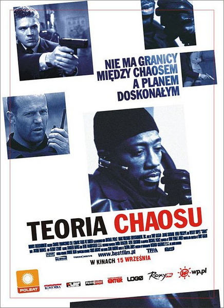
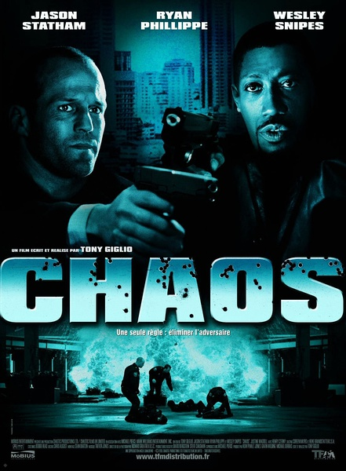
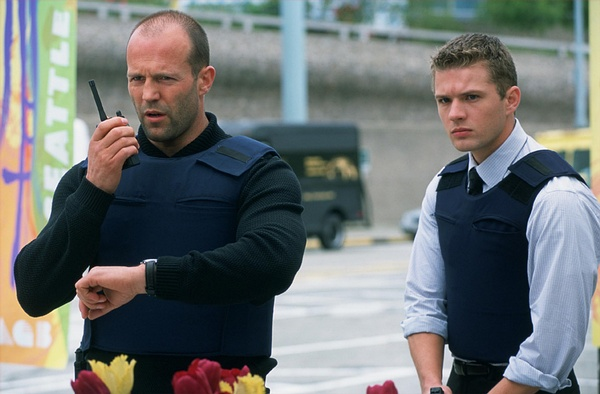

《乱战 Chaos》

			

老公的评论：
 
　　只要没看过的，就是新电影，所以乱战对我们来说，是部好看的“新电影”。
 
　　从个人感觉来说，我比较喜欢那种重视剧情胜过重视视觉效果的电影，这部电影就是如此。
 

　　看过克里夫·欧文的《局内人》，这部电影的前边银行劫案部分和《局内人》有一点像，但后面的悬念则更“悬”一些，直到那张有问题的钞票被注意之前，斯坦森所扮演的康纳斯都没有暴露出自己的本来面目。
 

　　这部电影不够完美的地方就是最终罪犯一方获得了胜利，而在警方的记录上，康纳斯已经是个死人了，所以警探肖恩的坚持未必会有什么结果，康纳斯策划的很完美，但是死了那么多的人，特别是还有无辜的人就不应该了。
 
　　不过既然坏人的角色是斯坦森演的，那么最终坏人获胜，我也就只能接受了……，哈，期待他的新片。
 

老婆的评论：
 
　　斯坦森这次演了一个坏警察，而最后坏警察还能逃之夭夭，我想应该走了……哎！谁叫他是主角呢！
 

　　在看影片时，我一直在想到底康纳斯（斯坦森饰）死了没有？他到底和绑匪是一头的吗？这影片真的很悬疑，真的很斗智，那个第一天上班的德克表现的很抢眼，是个不错的人才！
 

　　你能想到从劫匪第一个电话开始就是局吗？接着在面外配合下，银行劫案的幕后老大，也是这次案件的总负责人，这一切说明康纳斯是一个聪明人，不过，我觉得他怎么能这么粗心的用了警局的赃款呢？！
 
　　总的来说这是一部不错的影片。

上映年份：2007							
		
http://blog.sina.com.cn/s/blog_52187ba901012289.html
