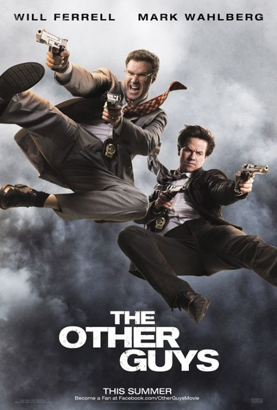
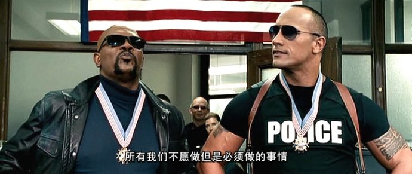
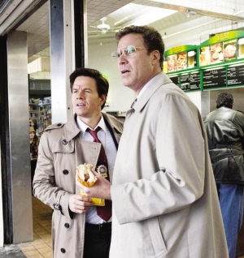

《二流警探 The Other Guys》

			【夫妻影评】《二流警探 The Other Guys》

老公的评论：
 
　　我猜这部电影算不上大成本，但却是那种可以让你保持住关注的电影。
 

　　马克·沃尔伯格和威尔·法瑞尔对于我们来说都是熟脸儿，我一度把沃尔伯格当成了科林·法瑞尔或者马特·达蒙，至于法瑞尔我则更是想不起来在哪里见过他了，后来老婆大人查过了，是《家有仙妻》。
 

　　这是一部很轻松的喜剧，从塞缪尔·杰克逊何巨石强森的出场，到马克·沃尔伯格居然精通各种雕虫小技，再到威尔·法瑞尔长得虽然很对不起观众，但是却在剧中很受美女青睐，再到主人公居然指挥练习生用高尔夫球打下了直升机……
 

　　自2008年以来，有关金融犯罪的影视作品多了起来，我想我们不应该把这些只当做电影看，因为有可能这些事情就发生在我们的身边——哪里有那么多好的理财产品，不要轻易相信陌生人的建议啊！
 

 
老婆的评论：
 

　　看了好一会，我以为是在看一部电视剧，还说这部电视剧的开场可够激烈的，巨石强森和塞缪尔·杰克逊饰的这两名警察够不要命的，我和老公说他们俩估计一会就的完，主角一定不是他俩，也因为我看见霍伊兹（马克·沃尔伯格）了，没想到的是他们离去的方法太让人搞笑了，两人直接从二十层楼上跳下去了，直接是一点同情分都不赚到。
 

　　霍伊兹和甘博（威尔·法莱尔）这对搭档在警局属于不起眼的二流警察，经常处理一些文案，霍伊兹不甘心，他也想成为英雄式的人物，可甘博并没有这样的目标，结果霍伊兹拿着枪逼着甘博去查案，不小心这两个二流警察也赶上了枪林弹雨，赶上了二次被绑架，还需要飙车来躲避追捕，他们真的做到了，赢得了荣誉。
 

　　整部影片很轻松也很搞笑，是属于那种需要点时间才能体会出来的搞笑。剧情上也还可以，有点励志片的感觉，不用甘心当一个二流人物，你也可以是英雄的。
 
　　看电影时觉得威尔·法莱尔眼熟，查了一下，原来我们看过他演的《家有仙妻》。
 

 
上映年份
2009
　　
主演Allen……Will Ferrell
艾伦……威尔·法瑞尔
Terry……Mark Wahlberg
特里……马克·沃尔伯格							
		
http://blog.sina.com.cn/s/blog_52187ba90100oyk5.html
