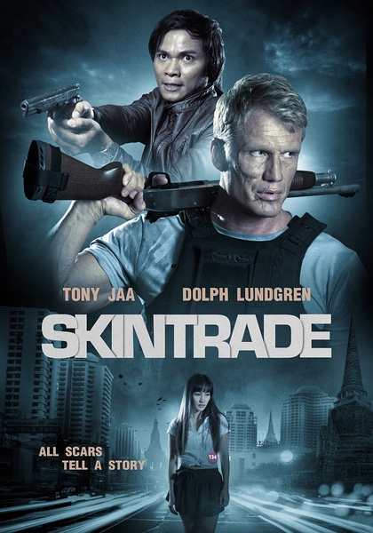
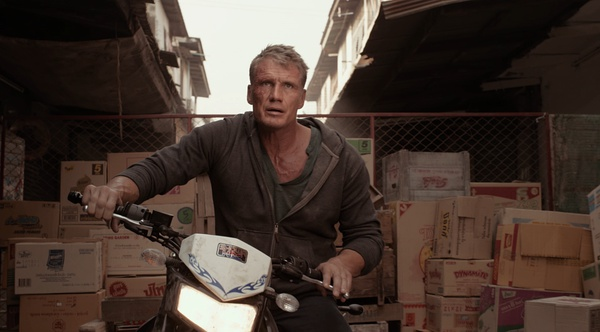
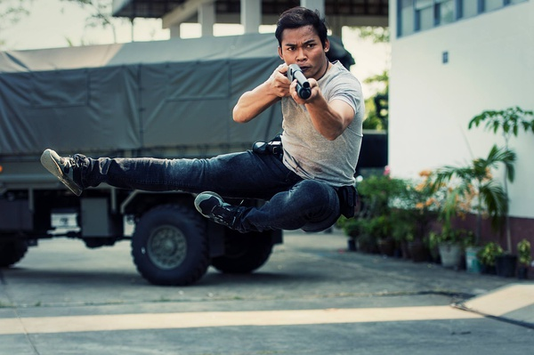

《人皮交易 Skintrade》

			

老公的评论：

　　杜夫·朗格真的已经是很老了，查过资料确认了一下，即便这部在拍这部电影的时候，他也已经五十六七岁了，其实我有些搞不懂这样的明星演员为什么到了演艺生涯末期还要再接拍电影。

　　在这部电影之中，动作戏的主要部分都被托尼·贾承担了，虽然贾也不再是个小伙子，但是比起来，朗格更多的动作只是原地攻击防御，打斗的时候还好，跑步的时候朗格动作的老态非常明显，觉得替他有些不值得。

　　龙·普尔曼虽然也不再年轻，但是他在这部电影中并没有什么动作戏，所以还好，对他的印象还是停留在了地狱男爵的时候……

　　迈克尔·加·怀特倒是还不错，一招一式有板有眼，力量感十足，再想一下杜夫·朗格，真是“自古名将如美人，不许人间见白头”啊，英雄迟暮！！！

　　至于这种动作电影的情节，我真的觉得没有太多好评论的，杜夫·朗格和托尼·贾明显是正义的一方，而且他们并非被限制在了法律的条条框框之内，而是用自己的方式去复仇，去打击罪犯，挺过瘾、挺解气。

　　龙·普尔曼饰演的黑帮老大很有气魄，电影最后部分他嘱咐两个孙子报仇的话够狠！

　　在电影中并没有什么喜剧笑料，而且电影中的一些细节处理的也不够完美，不过动作电影嘛，是看动作的，不是看细节的，过瘾就好，托尼·贾的腿功确实好看！

老婆的评论：

　　要说这部电影的熟脸孔还是挺多的。有的时候我觉得很奇怪，为什么主人公要用年龄这么大的，尤其是在这样一部动作为主的电影里。看着杜夫·朗格的动作有点僵硬的跑动和打斗，我不知道该说什么？

　　在我看来，这部电影应该叫尼克复仇记。

　　美国警察尼克·卡西迪（杜夫·朗格扮演）因为追查人贩集团导致老婆和女儿被杀，他不顾一切跨国去追杀人贩集团的老板及他的儿子。

　　在泰国，尼克的同事追过来，并且陷害他杀了警察，以至于泰国警察托尼（托尼·贾扮演）咬着尼克不放，还好，揭露黑警的时间比较早，尼克和托尼联手把这家人贩集团的老板及其儿子干掉了。

　　托尼·贾的打斗还是挺好看的。

上映年份 2014							
		
http://blog.sina.com.cn/s/blog_52187ba90102wrlx.html
