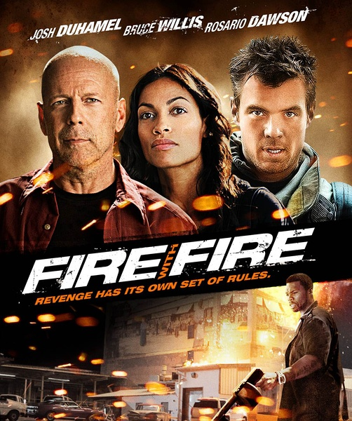

《以火攻火 Fire With Fire》

			

老公的评论：
 

　　一个消防员要对抗一个黑社会组织，要靠什么来完成复仇大计——用他最擅长的火攻——有一定的合理性，诸葛亮和周瑜都是这么觉得的。
 

　　这个片子很解气，主人公很强硬，不过法警就显得弱太多了，一个法警需要一个平民来保护，我想编剧在当初没有顾及这一点吧，挺有趣的。
 

　　还有就是那个狙击手，他死得有些太容易，而且他杀死同伴的那段戏到底要说明什么呢？我觉得他死的太容易可能是片子剪辑的问题，但是他杀死同伴就让我真的很不解了，为了塑造这个杀手的性格吗？可是后边根本就没有他什么戏啊？塑造一个路人甲的性格？
 

　　威利斯演的老警察……，确实是有点老了，希望更多的我所熟悉的明星演出电影，但是，希望看到的还是我熟悉的那些形象——有些形象在我心中是不灭的。

老婆的评论：
 

　　“杰里米是英雄，杰里米是英雄”，这是我看完电影后在沙发上喊得口号，是不是有点失态了？我承认我很激动，以至于晚上睡觉迟迟不能入眠，可能是一开始塑造的坏人太坏，把小超市的父子都给杀了，当杰里米把他们整个做掉时多大快人心。
 

　　要是证人都是这般厉害，警察还有什么可发愁的，最多就是帮着淹没一下证据而已，所以说黑社会也不是那么好混的，干的坏事多了，自然会有人来收拾他的。额，当布鲁斯威利斯出场时，我们都觉得这部影片应该差不到哪里去了，他应该是电影质量的一种保证。
 

　　好吧，我还要收回上次与老公关于《越狱》迈克尔杀死坏蛋不对，应该交回给警察的之类的话。像杰里米学习，逼供后再给上一枪，要是迈克尔早这么做的话，那么T-BAG也就不会再出来害人了。
 

　　还有我看到消防员脸熟，但忘了在哪儿出现过，后来查资料才知道叫艾里克·温特，在《超感神探》出现过，但演过谁忘了，这次发张相片留个证据吧。

                                         
艾里克·温特
上映年份 2012							
		
http://blog.sina.com.cn/s/blog_52187ba9010183if.html
