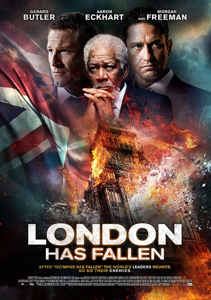
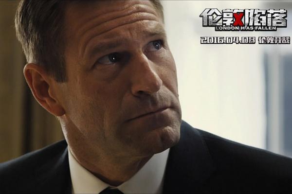
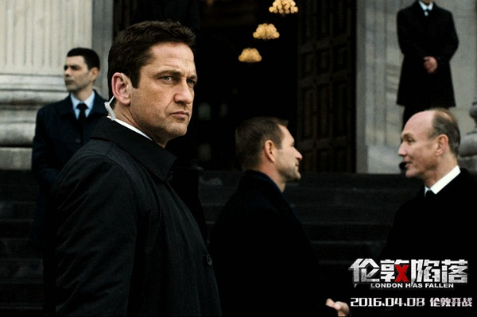

《伦敦陷落 London Has Fallen》

			

老公的评论：

　　节奏很快的一部电影，虽然让人感觉不那么真实，但是消磨时间还是挺不错的。

　　杰拉德·巴特勒一直就是我们比较喜欢的动作演员，不过从这部电影来看，他有些老了，身材也没有那么好了。

　　电影中巷战的那一段很酷，像是射击类游戏，处在这种战争环境里的士兵，恐怕想不兴奋都很难。

　　这部电影有两个地方我觉得不是很理解：第一是难道美国人杀伤了平民就不需要付出代价吗？第二则是复仇者抓住美国总统为什么不马上杀了录成录像在到时间播放呢？

　　为了显示自己孤胆英雄的伟大，就随便地把别国领导人写死了也算是比较有特色吧，除了美国特工，似乎其他国家的特工都是纸糊的，这个太逗了。

　　爆米花电影，过瘾可以，剧情细节禁不住推敲，也没必要推敲。

　　真期待什么时候中国可以拍一部美国总统被暗杀然后找中国求助的电影出来！！！

老婆的评论：

　　这次终于把战场移至英国了，又在伦敦上演那出孤胆英雄呢。不过，这次的场面更大，涉及的政要牺牲的也好多，原来又要内奸的事。

　　在我看来班宁（杰拉德·巴特勒饰）有点显得岁数大了，要那么孤身杀进百余人的敌后那是需要考验体力的，怎么说也是主人公即便是飞机掉下来也没不会死的，所以那么多政要就美国总统被救出，呵呵。

　　另外，在我看来，这种电影挺简单的，在某种场合出现问题，班宁要保护好总统，等待着支援部队。街头那段枪战让我觉得是一场枪击游戏的场景。

　　至于电影中关于恐怖分子的报复其实也没什么好说的。

上映年份：2016年							
		
http://blog.sina.com.cn/s/blog_52187ba90102x0ly.html
