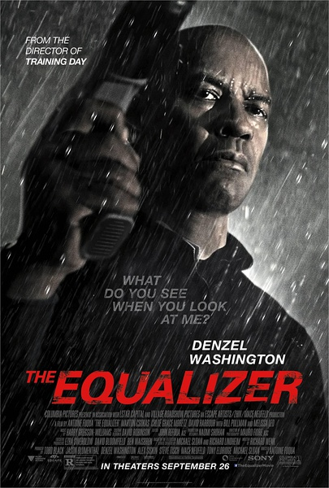
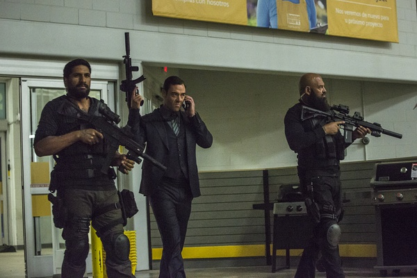

《伸冤人 The Equalizer》

			

老公的评论：

　　在查演员资料的时候，发现这部电影是改编自一部上世纪八十年代的剧集，没看过那部电视剧，但是觉得这个电影的风格真的是我们所喜欢的。

　　在太多的故事里，暴力都是属于坏人的，好人就算是复仇啊、主持正义啊也都是点到为止、浅尝辄止、古文观止……，这部片子的主人公则不是这样，他不仅要杀死对手，而且是一种接近虐杀的方法，酷。

　　还有就是主人公的手法是“杀”而不是“教训”，这点我是很喜欢的，我一直觉得“不是每个错误都可以被原谅”“种下什么样的因就要承担什么样的果”，所以，在电影里，“以牙还牙”是挺解气、挺过瘾的手段。

　　一直知道丹泽尔·华盛顿不是个年轻人，没想到他也已经六十岁了，看上去他的整体状态比史泰龙和施瓦辛格好了不少，虽然只差了几岁。

　　如果这个故事被改编，或者那部古老的电视剧被翻拍的话，我想我们会非常喜欢的，期待！

　　还有就是，这部电影名字的单词不认识，又长知识了。

老婆的评论：

　　为什么最近的主演都是年龄偏大的人呢？丹泽尔华盛顿年龄也不小了，还演动作片。不过，这部电影还是真好看。

　　虽然说这部电影是动作片，战斗起来非常的精彩也很酷，但整部电影还是给了我一种淡淡的感觉，主人公麦考尔的生活主线更是平淡，平凡不起眼的超市员工一个，偶尔帮助同事减减肥，在快餐店读读书有人搭话就聊上几句，怎么看怎么都觉得是普通人。

　　可为了帮助妓女泰莉，他开始出击了，不演他如何达到敌人跟前，就看见他很轻易把这几个俄罗斯黑社会搞定了，杀人的手法极其凶残，并且不留活口，在这方面我很喜欢他，对待敌人仁慈就等于为自己留下祸害。接着又帮助超市的同事搞定勒索她家的黑警，再把另一个被抢同事的戒指拿回来了，当然这些都是一笔带过，真正的敌人还是那些俄罗斯人，他等待然后反击，把这个有点变态的俄罗斯人杀了，最难得是，他单枪匹马的杀到俄罗斯人总部去了，并把普金斯给杀了，斩草除根永绝后患，有个性！

　　最后他开始做一个真正帮助他人声张正义的侠客……，当然这个是老公看出来的，有那么一会我好像没认真没看见他聊天的内容。

哈哈，我说我看过她演过的电影呢，查了一下才知道是《海扁王》。

他这样才算是真正的超市特工吧！比chuck像。
上映年份 2014							
		
http://blog.sina.com.cn/s/blog_52187ba90102velr.html
