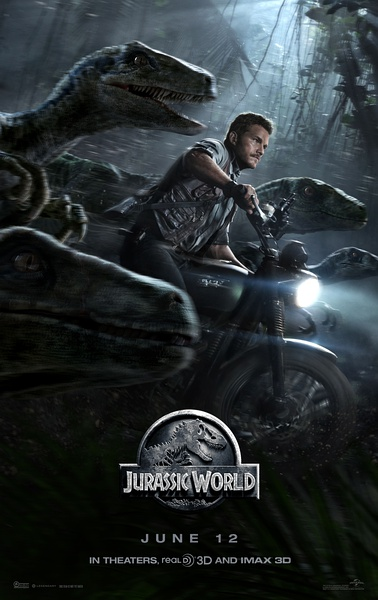
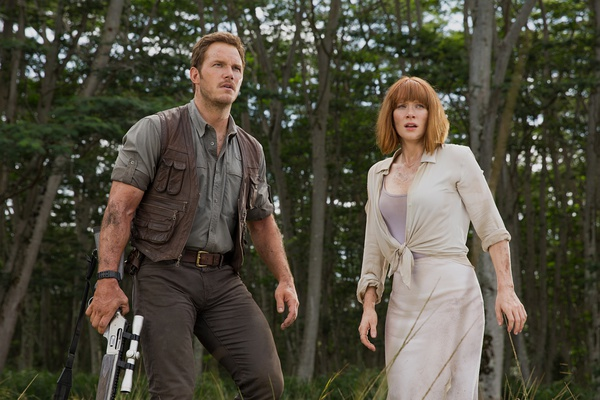
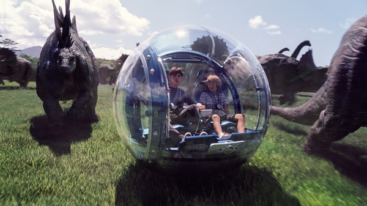
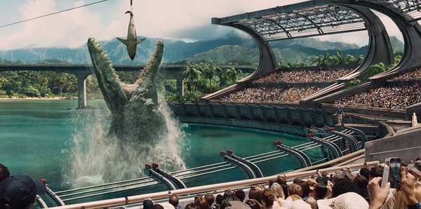

《侏罗纪世界 Jurassic World》

			

老公的评论：

　　华少因为喜欢“星爵”而向我推荐了这部电影很多次，如今终于得空慢慢地欣赏它了。

　　在这部电影之中我对“侏罗纪世界”这个“世界”真的很喜欢。如果真的有这么一座岛，岛上都是奇奇怪怪的生物，我一定要去看一下。或者，我自己真的想拥有一个能够自己规划、布置、开拓的岛屿，但是很遗憾，我不是比尔·盖茨。

　　在看完整部电影之后，我觉得影片中对于人的描写以及感情、性格的篇幅有些浪费了，其实看这部电影最刺激的地方就在于恐龙间的搏斗，这个才是真的好看的地方。之前有一部伪纪录片《与古兽同行》，因为其3D效果够好，我和老婆大人很爱看。如今这部电影也是，人和怪兽的战斗奥特曼里已经演的太多了，不如让怪兽互相厮杀……，有点疑问的地方是——如果退到七千万年前，以迅猛龙的个头儿，真的敢向霸王龙发动攻击吗？

　　在电影的一开始，我还以为邪恶的科学家把人类的基因注入了新的怪兽，后来这一点并没有表现出来。

　　电影的结尾，霸王龙独自在小岛上咆哮，会是续集的开始吗？这个岛的设计让我想起了一部很老的美剧《恐龙帝国》，是由温特沃斯·米勒主演的，可惜当时网络没有这么发达，没有看全，如今再看，却觉得有些陈旧了。

老婆的评论：

　　人真的很奇怪，一方面我很排除像电影里那些为各种目的研究出恐龙的人，我觉得正因为他们地球迟早会毁灭，另一方面我又知道，正因为这些人，世界才是现在的世界。

　　就这部电影来说，我觉得看的还是很痛快，很有感觉。

　　我在想，要是有这么一个恐龙主题公园，我要不要去？结论是我真的很想去看看。

　　多基因组成的霸王龙，眼看就要毁灭掉主题公园，搞不好恐龙岛上的人类都是他的开胃小菜，在迅猛龙和另一头霸王龙的帮助下赶到了河边，终于河里被更多牙的苍龙给拖下水了。

　　最后的镜头是那头霸王龙站在高处，看来是为下一部电影留下想象了。

　　很遗憾没看3D的，很多电影的效果没太感受到。

　　认出两个熟人克里斯·普拉特演过《银河护卫队》的“星爵”，凯蒂·麦克格拉思演过《梅林传奇》的女巫。

这样与恐龙近距离的接触多棒

上映年份　2015							
		
http://blog.sina.com.cn/s/blog_52187ba90102w3s6.html
