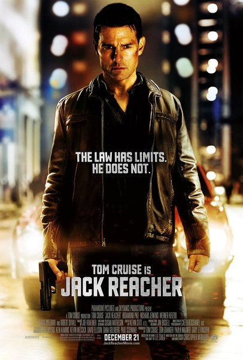
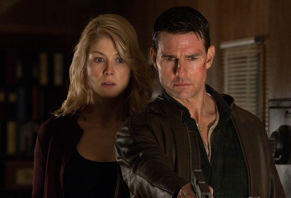
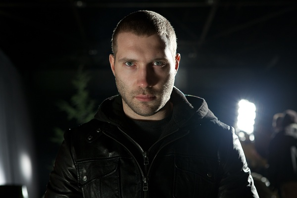

《侠探杰克 Jack Reacher》

			

老公的评论：
 
　　巨星是应该爱惜羽毛的，所以阿汤哥的片子应该都不会太差，这点我相信。
 

　　先挑个小毛病，就是我没看懂为什么在杀那个杀手的时候，杰克要放下手中枪而采用搏击，虽然最后踩脑袋的那一下很酷很暴力，但是当时的场景是还有一个人质等着他去营救，而且他不知道还有多少个敌人，是不是不用这么英勇啊？
 

　　这个故事的整体逻辑是非常好的，阿汤哥的演绎能力就更不用怀疑了，说穿了，这样的剧情，其他的人物都是配角，都打酱油就可以了。
 
　　我们爱看，首先是因为这样的故事题材很好，杰克的形象真的很游侠，从某种意义上来说，他是我们喜欢的地下法官。
 
　　感觉上这个故事可以再拍长一点，把它拍成一个剧集，那样能更纠结，也能够有更多的行侠故事。

老婆的评论：
 
　　最近一直在看美剧，有一段时间没看电影了，这部电影没有让我们失望，很好看，以至于吊起来我们要看电影的胃口。
 

　　我和老公一直都喜欢如杰克这样的主人公，很聪明很厉害，对待敌人绝不留情，在诠释这一点上，做的还不够好，在与狙击手对决中，非常奇怪杰克把枪丢掉与他搏斗，为什么不直接开枪杀了他呢？在外面还不知道有没有敌人的情况下。
 
　　最有意思的事，就是那个关起来的嫌疑犯，最后他居然真的失忆了，以为这几个人都是自己杀的。
 

　　总体来说，编剧还是费了不少心思，随机杀人并不是随机行为，而是有预谋的要杀死其中的一个，这让侦破难得无限大，当然，再谨慎的犯罪，还是会留下证据的，只是看谁来调查。
 
　　不是很理解为什么那个幕后老头为什么不逃走？难道是因为他们组织对于那些办不成事的人都有更严厉的处罚？

                                      

上映年份 2012
 							
		
http://blog.sina.com.cn/s/blog_52187ba90101hagk.html
