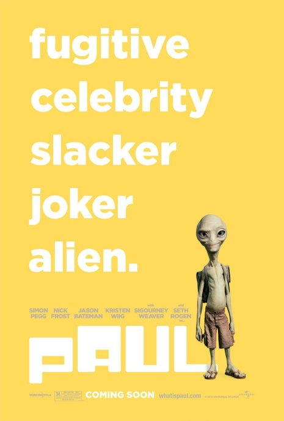
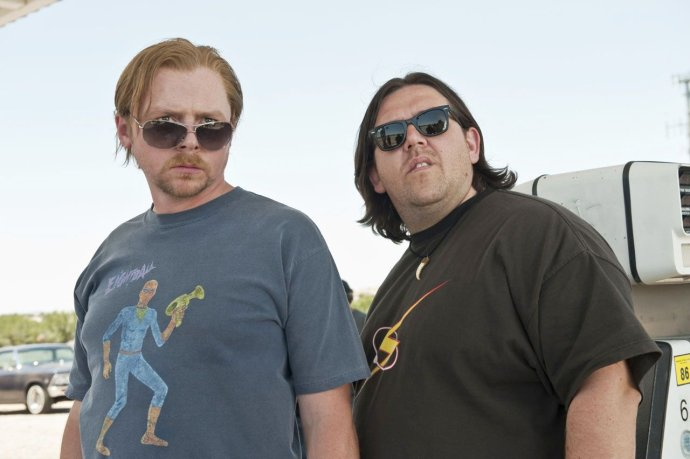

《保罗 Paul》

			

老公的评论：
 
　　这是一部英国的电影，所以感觉上和美国片子多少有些不同，呵呵，其实分辨英美影视的要点之一，就是主角的外形如何。
 

　　不喜欢的，是这部电影里的很多粗口，我觉得粗口并不应当是幽默的组成部分，但这也只是一点瑕疵了，这个故事的整体给人的感觉非常好，平淡、温情、真实……
 

　　遇到外星人，不知道有多少人有过这样的想法，我想，这绝对是每个科幻迷的想法，不由得想起了高中时候最喜欢科幻的刘雪松，随着时间的荏苒，估计他已经没有我这么喜欢科幻文艺作品了吧。
 

　　我一直觉得，外星人未必就比地球人的科技先进，但是能到地球来的外星人，他们的科技却一定是要比我们强许多的，或者，他们生出来就不是三维生物，可以通过我们永远无法探知的方法到达我们身边。
 
　　影片中保罗显然和我们一样是三维生物，如果身边有这么一个家伙，应该是很好玩的事情。
 

　　故事中的主人公看上去也有三十多岁了，我很羡慕他们的执着与童趣，要是在中国，这样年纪的人如果表现出对漫画、科幻如此喜爱的话，恐怕会很被周围的人取笑。
 
　　感觉这个电影题材很不错，不知道如果美国翻拍之后，会有什么不一样的感觉了！
 

老婆的评论：
 
　　刚开始看这部影片时，觉得没什么意思，坚持看下来，影片还挺温馨的。外星人保罗挺有爱心的。
 

　　在看这部影片时，我挺感触两个主人格雷姆和克里文公对外星文化的执着。两个人大老远的从英国来到美国科幻他们来到美国参加漫画展并且借机参观一些著名的UFO发现地。在路上他们遇到了一位绿色外星人保罗，而后发生了一系列的故事。
 

　　也不知道外星人出现在我面前，我会不会同片中的一些人一样，直接晕倒？还是我一下就能接受这种状况？我虽然并不觉得这个世界上有外星人，但并不影响我看各种科幻影片。而从中获得快乐。
 
上映年份
2011
 
导演
格雷格·莫托拉
Greg Mottol
编剧&主演
西蒙·佩吉
Simon Pegg
尼克·弗罗斯特
Nick Frost							
		
http://blog.sina.com.cn/s/blog_52187ba90100vxdo.html
