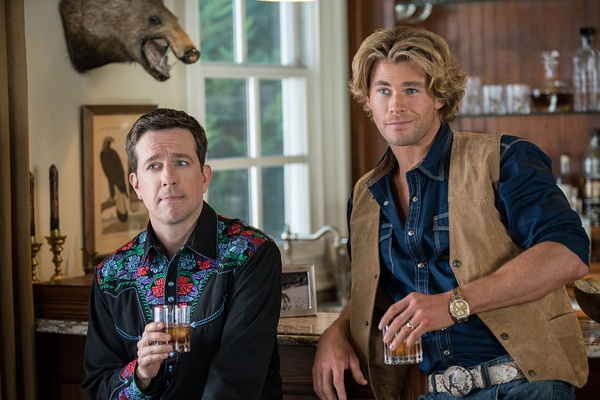

《假期历险记2015 Vacation》

			

老公的评论：

　　看了这部电影，至少我可以明白为什么国产电影有那么多烂片儿了——其实美国烂片也有不少啊，而且像这部——还是有不少明星参演的。

　　说实话，这部电影中的搞笑部分我真的是有点看不下去的，比如那辆旅行车、比如去粪坑洗澡、比如撞死一头牛……，太多太多了！而且我没有看过这部电影的前作，对续集有期待感和归属感……，看不出任何情怀！

　　不过，就是这么一部狗屎（没错，不是狗血，是狗屎）的电影，在最后的部分让我看到了温馨的一面，我觉得任何人为自己的家庭付出都是值得别人尊敬、值得自己骄傲的。

　　在生活当中，我们有可能都是笨蛋，但是只要我们对得起自己所负担的责任，就可以堂堂正正地“蔑视”其他人。

　　哈，说实话，这部电影要想像我这样理解一个升华出来的主题也挺难的，不过还是可以有点笑声吧……

老婆的评论：

　　我以为家长鲁斯蒂（艾德·赫尔姆斯饰）有点神经病，真不知道有的时候他怎么想的，同时，对于妻子黛比（克里斯蒂娜·艾伯盖特饰）来说，他是忠诚的。当他感觉到家庭出现问题时，他想要解决，就出现了这次神奇的假期。

　　小儿子凯文（斯蒂尔·斯特宾斯饰）老欺负哥哥詹姆斯（饰），而哥哥却一直让着，看着凯文往詹姆斯头上套塑料袋，我简直不知该怎么说？直到有一天詹姆斯反抗，凯文不敢了。

　　黛比对不能去巴黎旅行有点不满，看到鲁斯蒂的妹夫斯通（克里斯·海姆斯沃斯饰）家，更是有点感慨，后来知道其实这家只是表面上那样，似乎对于她的婚姻有了新的认识。

　　这部电影，他们在废水里洗澡真是挺恶心的。当他们全家对抗另一家时，他们家才是真正的同一条心了。　

上映年份 2015							
		
http://blog.sina.com.cn/s/blog_52187ba90102wre1.html
