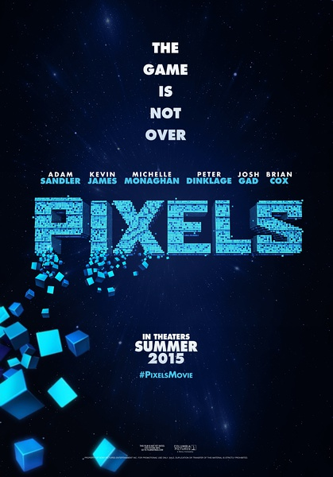
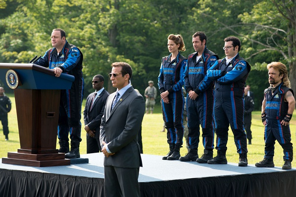
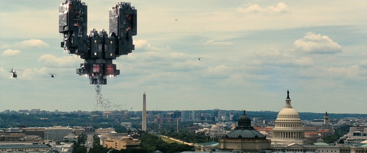

《像素大战 Pixels》

			

老公的评论：

　　还没有看《老炮儿》，但我觉得《像素大战》就是一部另类一点的美版《老炮儿》。

　　必须强调的一点是，我并不是彼特·丁拉基的影迷，因为他我曾经放弃了一部号称很好看的美剧。

　　而亚当·桑德勒还算是一个能被我们接受的喜剧演员，他饰演的很多角色都曾经带给我们笑声，在我们的记忆中留下了深刻的印象。

　　从个人角度来看，《像素大战》注定不会有太好的票房。不是因为电影拍的不好看，而是电影中的桥段已经完全和时代脱轨了。本来，怀旧题材的、历史题材的电影也会有市场，但是《像素大战》中的很多场景、细节，不是那个年代过来的人根本看不懂。

　　我不知道看过这部电影的人有多少能够叫出电影中每一个像素角色的名称或者说出角色游戏的名字，如果观众连这些游戏都不知道，怎么还能期待他们花钱买票来观看呢？和我一起观看电影的老婆大人，就不知道吃豆人吃过一个“特殊豆子”之后可以追杀“鬼”，这样她就会对剧情觉得莫名其妙！

　　所以，虽然我觉得还可以，但是客观地说这部电影有一定的局限性。忽然想起了小时候去过的那些游戏厅，官园儿少年儿童活动中心的、动物园里边的、扣钟庙的、北展的、甘家口的……，唉，记忆真的是我们最宝贵的财富！

　　电影中有一件事情说的很对，那些街机老游戏都是有规律的，找到规律就容易多了，记得我最喜欢的游戏是《饿流祸》和《恐龙岛》，直到现在，我还会用模拟器玩一下……

老婆的评论：

　　大概是因为我没有玩过那电影中的游戏，我对这部电影并没有特别的感想，唯一的深刻的感触那就是幼稚。

　　地球很多年前发射了游戏到外星，本来平和的外星觉得接受了战书，多少年后他们就用游戏里的场景方式来入侵地球。

　　美国出动了大量的军队也无法解决这些入侵者，总统威尔·库珀（凯文·詹姆斯饰）让好友极为擅长街机游戏的玩伴山姆·布伦纳（亚当·桑德勒饰）和另一个擅长街机游戏的勒德洛·莱门梢夫（乔什·加德饰）来训练其队伍，效果不是很好。

　　最后山姆·布伦纳、勒德洛·莱门梢夫和埃迪·普兰特赢得了战斗。

上映年份　2015							
		
http://blog.sina.com.cn/s/blog_52187ba90102wamg.html
