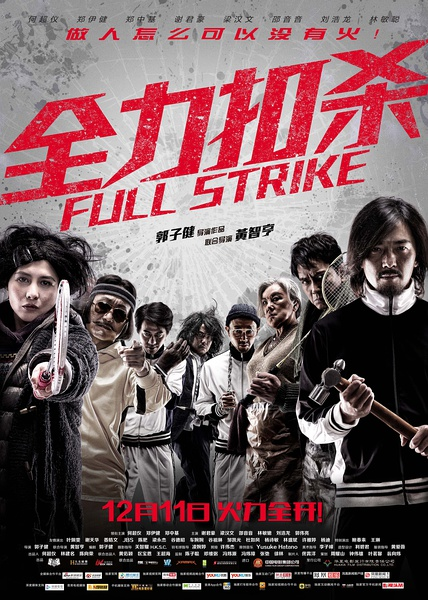
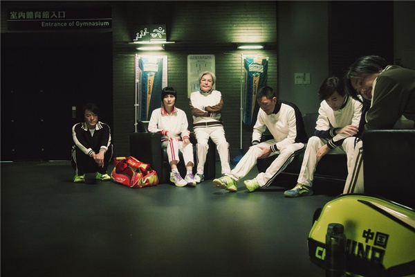
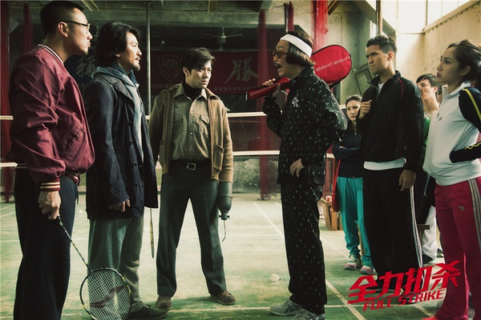

《全力扣杀》

			

老公的评论：

　　一直不知道何超仪是赌王的女儿，挺厉害，觉得她的扮相很像梁铮，哈，不知道有多少人知道梁铮了……

　　郑伊健在本片中的造型让我知道了一件事情——留胡子的男人和不留胡子的看起来可以差五岁以上……

　　梁汉文看上去很斯文俊秀，有点怀念他演的唐僧，可惜他一直没有大红起来……

　　至于谢君豪……，怎么都老成这样了，记得他在《我和僵尸有个约会》里的莱利（秦始皇）还是非常帅的。

　　郑中基么？干嘛把自己扮的这么猥琐？这部片子并没有发挥出他的喜剧天分……

　　看到网上很多人都批评这部片子关于羽毛球的部分不够专业……，我觉得没必要这么去评价一个电影吧，很多违反物理学尝试的电影，我们还不是一样当大片看？

　　可能是我看的电影少，这是我看过的第一部关于羽毛球题材的电影，觉得至少选题很新颖，这也触发了我的一个想法……，为什么不多拍一点关于中国人喜欢的运动项目相关的文艺题材呢？

　　笑点有些低俗，但是看看郑伊健，也算是在看情怀吧……

老婆的评论：

　　这部电影有的镜头挺恶心的，如果他们是要达到恶心人的目的，我想他们实现了。刚开始的一些着装和扮相看着也让我不太舒服。

　　每个人都在找自己生活的意义，吴久秀（何超仪饰）如此，刘丹（郑伊健饰）和他的朋友们也如此，甚至吴久详（郑中基饰）也如此。

　　为了那场证明自己的羽毛球比赛，大家都竭尽全力的训练，克服自己的问题。一个独臂邱林（梁汉文饰）一个瞎子林坤（刘浩龙饰）一个耳聋还有一个有心理问题，这队组合真是问题很多。

　　当然最终他们都战胜了自己。电影为了增加难度，最后时还来了一段刘丹他们闯出帮派，真是艰难。
　
　　最后想说，为什么要搞那么多的方言？

上映年份 2015							
		
http://blog.sina.com.cn/s/blog_52187ba90102wre2.html
