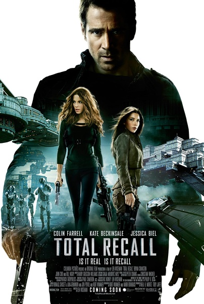
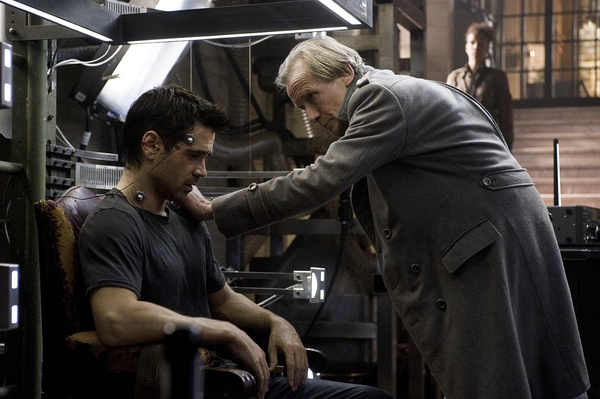
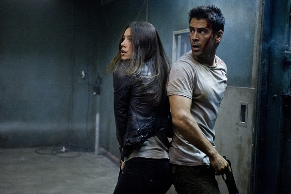
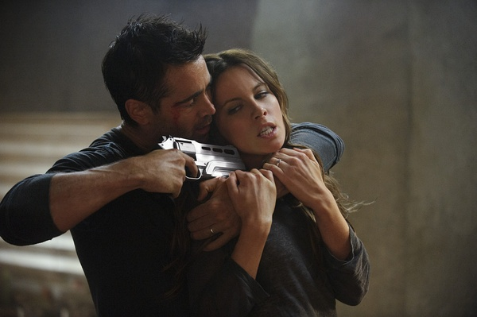

《全面回忆 Total Recall》

			

老公的评论
 

　　科林·法瑞尔算是一个我们还比较喜欢的演员了，因为这部《全面回忆》又查了一下他的资料，唉，怎么吸毒呢……，过去很久的事情了，希望他能做一个更正面的形象。
 
　　法瑞尔给我留的印象比较深刻的影片是《谍海计中计》和《狙击电话亭》，这两部电影都很精彩。
 

　　回到《全面回忆》，这应该算是一部大片了吧？片中那么多的特效，那么多的关于未来的描述、包括未来武器、未来警察、未来交通、未来通讯……，有些突破。
 

　　但未来只是背景，这部电影整体来说是一部纯粹的动作片，酷炫有余，然而精彩好像总是差了那么一点点，或者说片子已经足够调动起我的胃口，却还是差一点点达到而没有达到我想象中的高度。
 
　　没有看过1990年的那部电影，因为太久远了，也没有兴趣找来看了，但这部《全面回忆》已经足够精彩。
 

　　电影中“穿过地心”的飞船，算是比较靠近主流的科幻题材了，有点意思。而更多的融入了中国元素作为电影的背景，是不是说目前西方电影界已经很在乎中国市场了呢？
 
　　精彩的电影，如果调子能不这么昏暗，多一些明快的话，我会更喜欢。

老婆的评论：
 

　　这部影片挺打的，在制作上似乎花了大成本，而他们创建的那个未来也很符合我心中的那个未来景象，正因为这样，我觉得这部影片看的挺过瘾的。
 

　　主人公道格拉斯·奎德一直在做同一个梦，梦见自己被追杀，这个梦打破了他平静的生活，他去体验“记忆服务”，接下来发生的事情让我有挺长一段时间分不清到底是现实发生的事情，还是只是记忆服务而已，不过貌似编的就是真实发生的事情。很可怕吧，战争就此拉开了，而结婚的7年的太太只是一个被植入的一段记忆，其实是被放在身边的一个特工，奎德被追杀中。
 
　　这部影片剧情没什么可说的，关键在于感观的享受。
 
　　哈，认错人了，把凯特·贝金赛尔认成《妖女迷行》中的Bo了，其实我之所以觉得她眼熟，是因为看了她《黑夜传说4
》和《范海辛》。

                                   科林·法瑞尔&杰西卡·贝尔

凯特·贝金赛尔

上映年份 2012							
		
http://blog.sina.com.cn/s/blog_52187ba9010183jr.html
