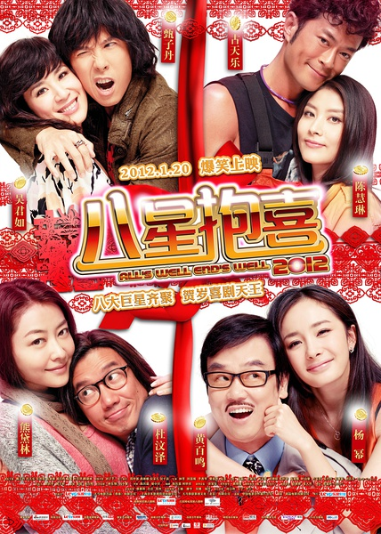
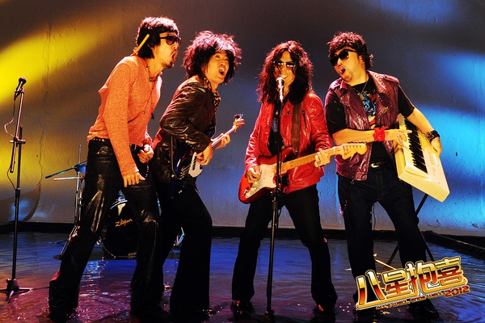
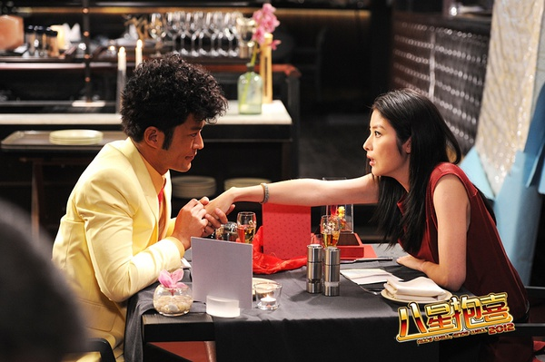
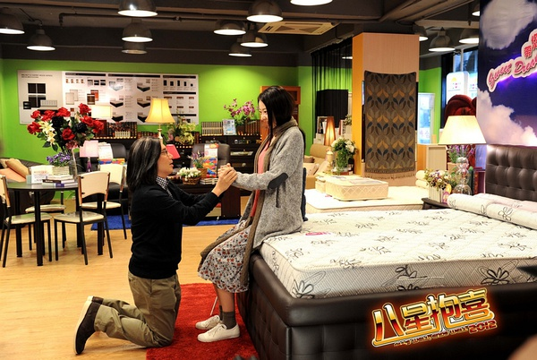

《八星报喜》

			

 
 
老公的评论
 
　　感觉又有很久很久没有看港片了，连续剧还在看着，但是港产电影真的在慢慢地淡出了我们的视线。
 

　　《八星抱喜》是一部有点无厘头的喜剧，在八位明星扮演的角色当中，我比较喜欢的桥段都是属于古天乐与陈慧琳这两位演员扮演的，因为他们演的是纯粹的喜剧，甄子丹和吴君如饰演的角色过于励志；杜汶泽和熊黛林扮演的情节好像有些前后矛盾，特别是欺骗盲人的那段我很不喜欢，还扯上陈冠希，真的是俗没关系，但是不能这么恶俗；黄百鸣和杨幂扮演的父女有点过于煽情，过了，真的有点偏离了港产喜剧的范围。
 

　　我觉得古天乐扮演的工头的剧情已经可以单独拍一部电影了，特别是他们几个工友耍酷的那一段，让我依稀又看到了《新家法》的感觉，古天乐还是帅的，虽然老了点，但是同辈中人里，也只有他还经常出现在我们眼前了。老婆大人在这里补充说，甄子丹也是一样，差不多的片子了总是经常看到这两位的身影。
 

　　不知道为什么，每次看见有大陆演员出现在香港电影里，都会觉得这部片子的质量要差一些，因为他们过多地考虑了市场开发而并非电影本身吧，就算是偏见，我依旧觉得这样不好，很不好。
 
　　看着古天乐，总是会想起郑伊健，唉，那个年代的香港影星都去哪里了？

 
老婆的评论：
 

　　说了是喜剧，那么不管电影如何进行，结局总是美满和大团圆，要我说像这种贺岁片千万不要去挑他们的毛病，看的就是一个热闹，你同意吗？
 
　　你见过有人带着礼物床垫去餐厅吃饭？在这边片子里古天乐演的彭坚就这么干，不过我觉得送双人床垫会更好点嘛！
 
　　你见过有人在约会中用喷头喷水假装是下雨吗？当然对象是一个看不见的人，虽说感觉上怪怪的，但也不失为一种创意吧。
 
　　这部影片中最让我不能忍受的是甄子丹的形象，这个真不像是他的风格。
 
　　额，我最想说的是杜汶泽在这部片子中怎么这么像陈可辛啊！

                              这样的甄子丹，感受是不是有点奇怪？

 彭坚（古天乐饰）就带着后面的床垫去餐厅见Julie（陈慧琳饰）的。

华一星（杜汶泽饰）的别墅是不是够大？
上映日期：2012年							
		
http://blog.sina.com.cn/s/blog_52187ba901011m8y.html
