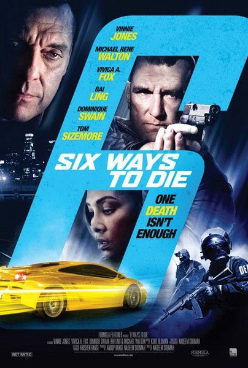
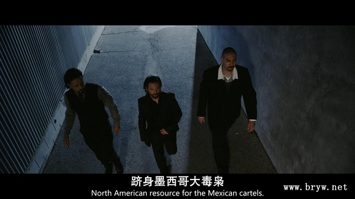

《六种死亡方式 6 Ways to Sundown》

			

老公的评论：

　　很另类的一部电影，和被我们看了一半放弃的《88》差不多，不是说电影的故事情节有多么好，而是靠倒序的拍摄手法来增加观众的投入程度，并不是真的好选择。

　　维尼·琼斯被我所熟知因为他曾经是温布尔登的球员，而且不是一个很文明的球员，不过他在电影中的卖相真的很不错，可惜他现在也有点老了，在这部电影中，琼斯只是坐在汽车里就几乎出演了整部电影……

　　自由、爱情、荣耀、宝贝、财富，以及性命……，一个人真的可以死六次吗？如果你失去了这六项拥有，你会怎么样呢？

　　这个故事的题材很不错，但电影的表现力还可以提高很多，希望这部电影能够被大制作翻拍一下，应该会很有看点的。

　　看的有点累，不过可以消磨时间！

老婆的评论：

　　我以为这种电影拍的很奇怪。

　　其实这又是一部我不太看得懂的电影。为什么这电影的片名叫《6种死亡方式》？这整部电影只是有人用了6种方式去整垮自己的仇人“日落大盗”Garcia而已。

　　让不同人对针对“日落大盗”Garcia的自由、爱情、荣耀、宝贝、财富，最后是要他的命。

　　结果这一切也在“日落大盗”Garcia的算计中，最终他把爱情、荣耀、宝贝、财富给出去了，留下了自由。

　　所以，这是一部不好看的电影。

上映年份　2014
							
		
http://blog.sina.com.cn/s/blog_52187ba90102wfvc.html
