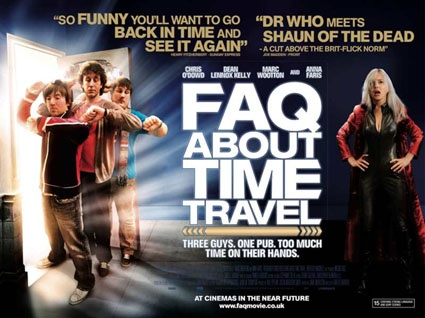

《关于时间旅行的热门话题 FAQ About Time Travel》

			【夫妻影评】《关于时间旅行的热门话题 FAQ About Time Travel》

老公的评论：
 
　　从拍摄上来说，这是一部小成本的电影，但这并不影响这部电影吸引人的程度。
 

　　从我个人的观点来看，这部电影并不是拍给大众的，而是拍给那些真正的科幻迷的，电影中的主人公是让科幻迷们羡慕的，他们完成了我们的梦想——穿越时空。
 

　　电影里虽然提到了蝴蝶效应，提到了祖父悖论……，但让人听的并不枯燥，没有爱因斯坦的相对论，没有虫洞，没有如何超越光速，但充满了科幻。
 
　　如果可以，我真的想和电影中的主人公们换换身份，去经历一下那种超越时间的感受。
 
　　我想，这部电影真的可能会有很多人看不懂，但科幻迷绝对不要错过！强力推荐！
 
　　中国什么时候能拍出这样的电影，中国的电影就有希望了，人类的未来也就更有希望了！
 

老婆的评论：
 

　　对于喜欢科幻的人来说，这无疑是一部很好的电影，至少从老公的喜爱程度看的出来。坦白来说，这样一部小成本电影，能够拍成这样，已经是一部非常不错。
 

　　电影进行时，我和老公说，这部电影不会就这三人在这间酒吧里都完成了吧，虽然没我说的这样夸张吧，但也真差不多了。习惯当下的各种大片风格的我，对这部影片怎么也爱不起来。就这样，我也很认真的看完了这部影片，从这几人聊的话题，关于时间旅行，平行世界及悖论，最近老公经常带着我讨论这些，所以认真学习是有必要的。
 

　　从电影的角度，这些话题相对来说，我更喜欢时间旅行，不仅是因为看过《时间旅行者的妻子》，这部影片让我感动的稀里哗啦的，科幻加上了爱情的因素，让我更容易理解，幻想着时间旅行这种美好的感觉，哦，一定要买彩票。
 

　　平行世界，原来在看《神秘博士》时就有所了解，最近因为影视作品及书籍对这个也似乎有更深的体会，今天和老公还互相戏弄的说，是因为去了男女厕所，出来后就不是原来的世界啦。
 
　　只是对于悖论，我总觉得是在绕圈子，对于这种思维方式，我不太喜欢，简直是难为我的5颗脑细胞。
 

上映年份
2009							
		
http://blog.sina.com.cn/s/blog_52187ba90100nq8w.html
