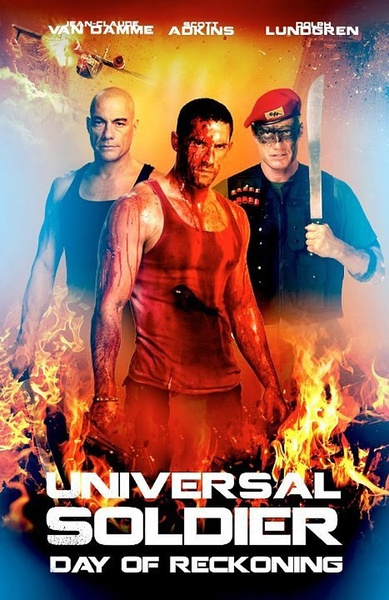
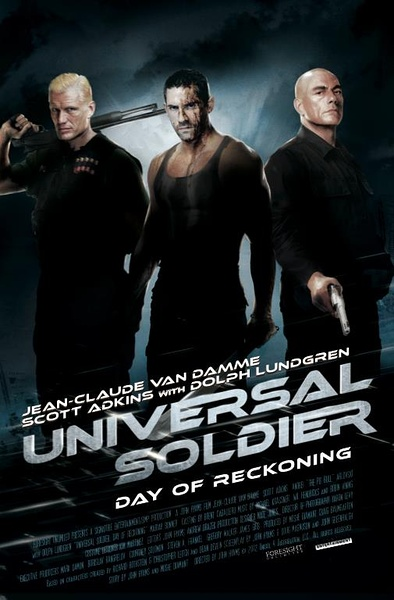
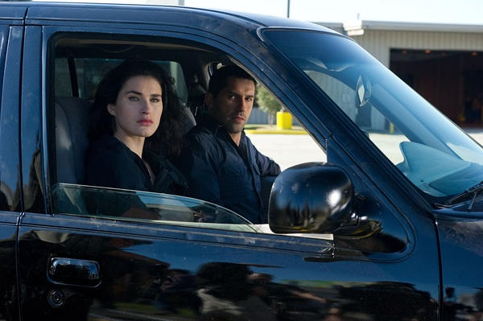

《再造战士4：最后的审判日 Universal Soldier: Day of Reckoni

			

老公的评论：
 

　　对尚格·云顿和杜夫·朗格谈不上非常喜欢，所以虽然看过他们俩演的不少电影，但是印象都不是很深刻，以前，也没有看过《再造战士》的前几部。
 

　　《再造战士4》开头的悬念制造的很不错，原来一切都是幻觉，主人公显得很可怜，《再造战士4》的结尾也很不错，主人公是要建立起新的组织吗？有点意思。
 

　　剧情紧凑，而且打斗基本保持了西片的风格，一下一下的很扎实，对于动作片，实在评论不出太多什么，喜欢血腥的朋友还是自己去看吧。
 

　　虽说是一部科幻剧，但是真正属于科幻的部分并不多，如果非要算，主人公的再生能力和特别禁揍算是吧，要不是他那么禁揍，很多情节就进行不下去了。
 
　　不过在最后“独闯龙潭”的部分，显得还是老旧了一些，敌人都是一个一个地上来，很像老式电影，也算是一种怀旧吧！

老婆的评论：
 

　　我还真以为约翰的妻子和女儿被尚格·云顿的饰军人给杀了呢！老公还说为什么他们不直接杀手约翰呢？我还为他们想了很多为什么没杀死的原因，在看见约翰的断指又长出来时，我还想这就是为什么约翰没死的原因呢。
 

　　这部电影对于我来说看起来有点费劲，不明白又出来一个约翰是怎么回事？为什么约翰忽然与他们的奴役者决裂了，因为爱情？如何再生出来的，那些货又是什么？而为什么那些军人忽然臣服与约翰了？有的问题没有答案，有的问题又不太重要，反正植入的记忆让约翰是一个与众不同的战士吧。
 
　　抛开这些，我觉得这部电影看看西方这些动作打斗，那种力量的对抗还是很过瘾的。
 
　　另一个感觉，这部电影有点血腥，有点……

上映年份 2012							
		
http://blog.sina.com.cn/s/blog_52187ba9010176so.html
