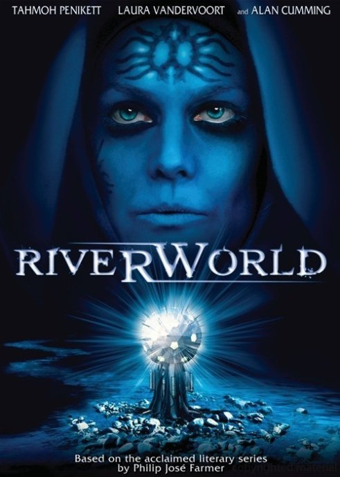

《冥河世界 Riverworld》

			【夫妻影评】《冥河世界 Riverworld》

老公的评论：
 

　　这是一部很另类的片子，之前，我们也看过描述人死后的世界的电影，我觉着之前看过的最好的是《乘客》，如今，觉得这部《冥河世界》虽然是小成本制作的电视电影，但其所包含的哲学观却有着独到之处。
 
　　描述人死后的世界，是一个很主观的事情，但是也正因为这主观二字，反倒使这个选题有了更大的发挥空间。
 

　　如果真的有冥河世界，如果里面的人的真的都再也不会死去，如果那里的景色真的那么美丽，如果人们到了那个世界都会恢复年轻，为什么还要改变那里的一切呢，何必去苦苦探寻冥河的源头呢？遇不遇到马克·吐温又有什么关系呢！
 
　　我和老婆大人商量了一下，如果在那样的世界，我们俩可以在一起的话，也会是一种不错的经历吧。
 
　　这要我们俩在一起，世界总是美丽和充满希望的！

老婆的评论：
 

　　老实说我看之前并不知道这部影片是四集小电影组成的，看的时候我还奇怪电影时间怎么这么长呢。这部电视剧的意境，很喜欢，人死后究竟和如何？为此老公和我在电影结束后专门还讨论了一下这一个话题。
 

　　人死后究竟和如何？电影并没有给我们揭开谜底。只是让我们知道人死后也许会到一个叫冥河的地方，那我们就跟着主人公们来认识一下这个叫冥河的世界。可冥河又是一个什么样的世界？主人公们死后不断重生，在那里没小孩和老人，却一样有压迫，有欺骗。有不同时代的人死后在那里相聚，主人公Matt在这里遇到马克吐温，遇到了日本女武士巴御前，遇到了Pizarro和柏顿，却要千辛万苦的寻找一起死去的女友Jessie。
 

　　Matt的好友sam在之后也来到了冥河，是因为地球混灭了。我们在想，冥河的人越来越多，怎么住的下啊！而且，地球上的人都去冥河了，那和在地球上又有什么区别呢？一样可以造船，造飞机。更重要的在这个地方还能保持这么年轻，多好的地方，又何必去探索这个地球是什么样？Matt他们可以没事钓钓鱼，打打麻将，岂不是美哉。
 
　　一直不太明白这些蓝脸的女人和蓝脸的男人是干嘛的？他们喜欢挑起地球人互相战斗只是为了观看为乐？还是他们的行为有所图？
 

　　本片我觉得还是值得一看的，看的不是主人公一定要去寻找冥河的秘密，而是带给你一种思索，人死后究竟会如何？也许将来用的上。

上映年份
2010
 
 							
		
http://blog.sina.com.cn/s/blog_52187ba90100nics.html
