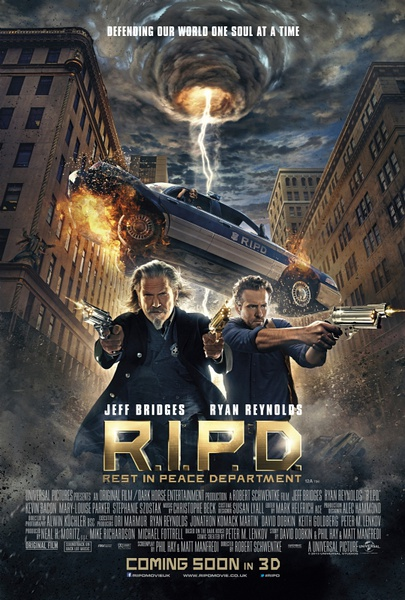

《冥界警局 RIPD》

			

老公的评论：
 
　　我们一直很喜欢灵异的题材，所以，即使不考虑拍摄的如何，我们也会非常喜欢《冥界警局》的。
 

　　我们喜欢的演员不多，这也让我们在很多时候更注意故事的情节，《冥界警局》首先设计了一个“一些已经死了的人装作没有死，活在活人的世界”的核心概念，然后再设计出“冥界警局的警察来把这些死人带回冥界”的延续，这样的情节很符合我们的口味。
 

　　影片中没有什么浪费的时间，整个节奏虽然谈不上紧张，但是紧凑。看惯了连续剧，觉得电影总要受篇幅的限制，很多背景和细节交代的都不够详尽，希望这部电影会有电视剧的版本出现，那样应该有趣的多。
 
　　这部电影有些《黑衣人》的影子，题材上也有点像我们喜欢的《邪恶力量》，虽然算不上最好的电影，但是可看。

 
老婆的评论：
 

　　要我说这是最近看的电影里能排第二位的，有剧情，有特效，小细节也设计的不错，还有我们喜欢的科幻元素，整个电影看下来很流畅，很舒服和让人很快乐，这就是一部好看电影。
 

　　老公问我死了以后，假如我也当上了冥界的警察，怎么与他联系？我想即使现在想好了暗号，当时也不知道是否还记得，哈哈，记得的话，就要来段人鬼情未了。
 
　　现在看电影也越来越多的熟人了，这片子里至少就有两个熟脸了，这也是乐趣之一额。
 
　　电影尼克的主演瑞安·雷诺兹已经荣升至我最喜欢的演员之一了。
上映年份　2013							
		
http://blog.sina.com.cn/s/blog_52187ba90101e03b.html
