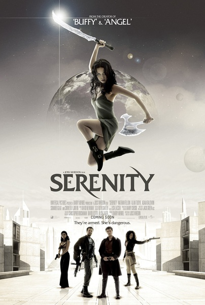
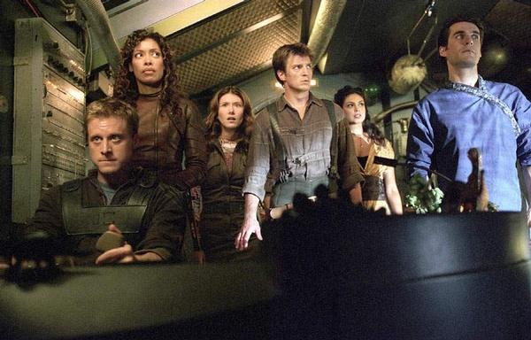
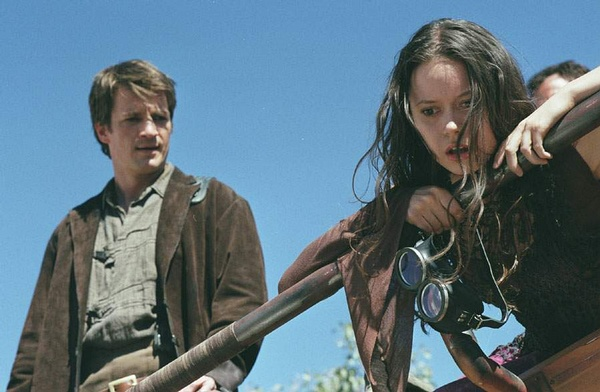

《冲出宁静号 Serenity》

			

老公的评论：

　　虽然这是一部2005年的电影，但是因为我还算比较喜欢《萤火虫》，而且这部电影里的许多演员都在后来的美剧中扮演了我们喜欢的角色，所以看看还是觉得挺有趣的。

　　船长Mal是《灵书妙探》的主人公；大副Zoe在我们正看的《金装律师》里扮演律所的冠名执行合伙人；Jayne主演过《超市特工》；Inara所主演的《V星入侵》也让我们很是怀念……，看了这么多年，这么多集的美剧，再翻过头来看一些老电影，找熟人，觉得很有趣，很有一些现在重看几十年前老港片的感觉。

　　据资料显示这部电影的票房并不好，事情总是这样，叫好的电影未必卖座，而且这部电影明显是为《萤火虫》的粉丝拍的，那些不了解《萤火虫》的观众确实比较难引起共鸣。

　　想起了之前说过的一个话题，羡慕这些演员的不是他们的成功与赚的钱，而是他们在不经意间的工作里记录了自己年轻的时光，这点真的很棒，不是每个人都是可以看到自己十几年、几十年前的最好的样子的，看着这些熟悉的演员，仿佛时间穿越了很久……

　　另外就是这些所谓的“古老”的影视作品，会更加注重故事的曲折与完整性，看起来更符合逻辑，真希望有一天《萤火虫》类似题材的美剧被再搬上屏幕。

老婆的评论：

　　哈，这部电影看的就是一个热闹，因为已经是一部老电影了，而这些主人公们都是我们看的电视剧的主人公，相对的熟悉。

　　十年过去了，再回过头去看他们演的电影，真的很青涩，与现在的气质也不同。

　　至于这部电影，虽然是很多年前的电影，其实放到现在看，也不过时，当年看的话，会比现在更有震撼力吧。

　　少女瑞娃身怀绝技，哥哥把她从星球联盟救出来，藏身在马尔的——“宁静号”飞船上，星球联盟在追查她，在一家酒吧里，视频隐含的信息激活了瑞娃的潜意识，她大打出手，暴露了。

　　马尔决定去瑞娃所说的摩兰达调查，得知一种药物导致那里的人都自然的选择死亡，而掠夺者也是药物导致的，他们要揭露星球联盟，一场战争不可避免，牺牲也在所难免了。

上映年份 2005							
		
http://blog.sina.com.cn/s/blog_52187ba90102vp4f.html
