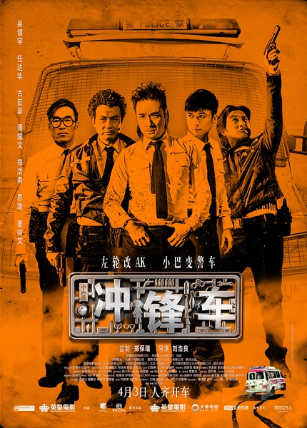
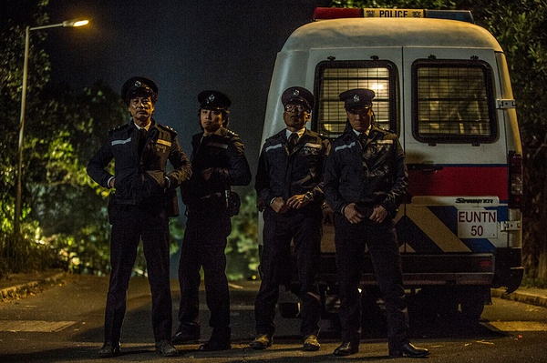

《冲锋车》

			

老公的评论：

　　任达华、吴镇宇、郑浩南、谭耀文、古巨基五位主演的电影，在没有观看之前，你回认为这是一部什么样的片子？以“冲锋车”为片名，会是一部警匪片，还是一部讲述警察执勤的片子？

　　在我个人看来，这部电影其实更好的名字应当叫《英雄》。因为从头到尾，故事都是围绕着徐Sir对于“英雄”的理解展开的。

　　虽然这部电影还不够满分的级别，但是我觉得作为一部优秀的港片已经非常合格了。好久没有看到这么好看的港片了。

　　不恶搞，但是是一部真正的喜剧，故事中人物的性格还是比较符合人的心性的。

　　在细节处理方面，我觉得对小朋友见报的那个细节非常漂亮，这解释了之前的很多疑问；另外，点睛的地方就是结尾，哥儿几个商量着要把龙舟改造成军舰，然后把那个岛夺回来——太能引起共鸣了！

老婆的评论：

　　几个老人家演了一出戏，算是诠释一下人生，多少有点励志作用，整个感觉还是不错的。

　　一个计谋想了16年，他有没有与时俱进啊？能不能帮助他们完成夙愿呢？听着都不靠谱，他的三个兄弟居然同意了。更没想到的是，有另一伙人同他们一样。哎！所以人类多奇妙啊。

　　以发哥（吴镇宇饰）想出来的奇点子，用小客车改造的冲锋车去抢劫运黑钱的运尸车，先救下了一个姑娘，然后与另一辆假冲锋车相遇，又救下了一个小姑娘，再神奇的他们还把那伙武器更强的“竞争对手”给抓去交给警察了，原因是“竞争对手”太暴力，太喜欢杀人，留在外面会很危险。

　　当然，最后他们还是进了监狱。

　　有时间好好看看这部电影，里面的对话有的很值得人去琢磨，徐SIR的一些话发人深省，有的对话很有意思，结尾更是逗了。

　　吴镇宇、任达华、谭耀文、郑浩南，给人的感觉真的老了。

上映年份　2015							
		
http://blog.sina.com.cn/s/blog_52187ba90102w3s9.html
