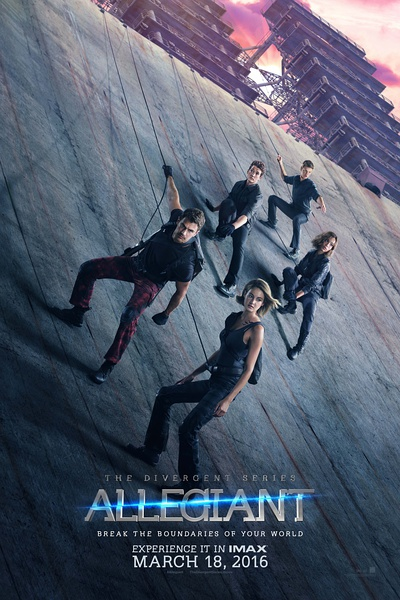
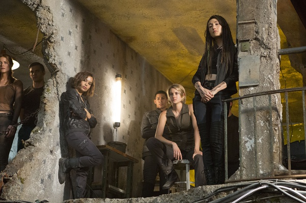
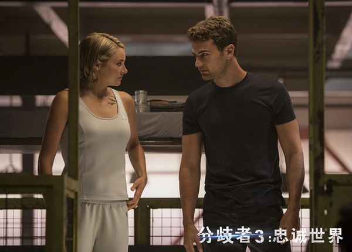

《分歧者：忠诚世界 The Divergent Series: Allegiant》

			

老公的评论：

　　实话实说，这部电影不好看，因为看过第三部之后，并没有丝毫看前两部的想法。

　　这部电影营造的末世氛围我还是接受的，但不明白的一点就是土地可以被腐蚀，那么难道那些屏障连天空、云朵、大气也能隔开吗？如果不能隔开，红雨为什么不会吓到城市里或者那些基因局的基地里呢？

　　我是想说，其实我想像中的未来世界并不是这样的，哪怕是末世论的未来世界，也不是这样的。

　　作为一个足够级别的科幻爱好者，我一直觉得人么对于未来世界的幻想都太“现实”了，无论怎么看，未来人都带有很浓重的现代人的影子，可回想一下过去——处于互联网时代的我们和20年前的我们思想差距到底有多大？——这才20年，未来人和我们现代的时间间隔总不会只有20年吧？

　　或者我有一些逃避的情绪吧，关于文艺作品，我并不喜欢那种所谓针对“人性”的描写的，特别是科幻题材，我更喜欢看到那种用未来科技的力量而非人力解决一切的场景。

　　一定是电影、电视剧看得太多，已经审美疲劳了……

老婆的评论：

　　第一部分和第二部歧者我们并没有看，所以在看第三部时，那些人物角色其实并不是特清楚，没有想到李美琪还出现了一下，当她饰演的角色很快牺牲时，我想上一部那个角色应该是主角之一。

　　在我看这部电影的时候，我想象的前两部，应该是那些被关在芝加哥城市的人翠丝（谢琳·伍德蕾饰）和老四（提奥·詹姆斯饰），他们对外面的世界好奇不愿意关在这个地方，作为实验者，那么他们应该拥有优秀的能力，才能在第三部初期逃出来。

　　我不是很喜欢，这部电影关于基因局对于DNA的分类方式，并且为了让他们所谓的事业，抢那些小孩子洗掉记忆拿他们的基因来做研究。在这方面，基因局注定是反派了。

　　未来的世界，在无数多的电影作品中，都被形容刻画成是黑暗的，是没有生机的末世论。也许随着环境的污染和资源的消耗，未来的世界的确存在危机，人们应该警惕。可大部分时候，我以为科技的进步和人类思想的进步，应该能超越这些困难，未来的世界应该更便捷更美好。

　　说实话，电影里的高科技，比如无人机挺让人向往的。总的来说，我不是很喜欢这部电影。

上映年份：2016							
		
http://blog.sina.com.cn/s/blog_52187ba90102x1bf.html
