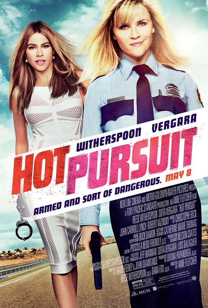

《别惹德州 Hot Pursuit》

			

老公的评论：

　　其实我是真的很奇怪这部电影为什么被翻译成《别惹德州》的，对于起名人员的水平我感觉真心地十分地佩服。个人觉得电影的另一个名字《辣妹双拼》更贴切一些！

　　虽然曾经一度很喜欢《情敌大战》这部电影，但是真的没有认出来库珀（瑞茜·威瑟斯彭）就是当年的女主角，也没有感到她原来是个矮个子……，这次威瑟斯彭扮演的警察不像个警察，倒像是一个饶舌歌手，不停地说啊说的，语速快，而且几乎没有什么逻辑连贯……

　　这部电影是部纯粹的喜剧——我总觉得如今的电影有“回归”的趋势——除了那些以亿为单位进行制作的特效大片，很多好看的电影正在回归到二三十年前的剧情感觉上：简单、有趣。那种老电影的主角们并不在乎自己扮丑甚至是搞笑的很无厘头，只要能够闹的起来就好。

　　片尾放了一些拍摄中的花絮——我总是很喜欢这些花絮，有的时候觉得其中的好玩儿程度甚至超过了电影本身……

　　有些好玩儿的电影，但是如果期待看到精彩的打斗场面的就不要期待了！

老婆的评论：

　　我有点被女警库珀（瑞茜·威瑟斯彭 Reese Witherspoon
饰）的声音烦坏了，她就不停的在说，在说。再加上她保护的那个证人里瓦夫人（索菲娅·维加拉
Sofía Vergara 饰）的声音也很难听，在这点上我很不喜欢。

　　那个很烦的库珀是一个很有正义感的好警察，她保护里瓦夫人也真是很尽力，只是有点笨，还有点太教条了。她先经历搭档被杀，而后又经历同事是坏人，还得好好逃命，最后让人没想到的是，她的老大也是坏人。命运何其悲惨，本着好人有好报的结局。最终她成功的完成任务，升了职，外加找到那男朋友。

　　这部电影总的来说，就是两个女人的搞怪，可以一看。

上映年份　2015
							
		
http://blog.sina.com.cn/s/blog_52187ba90102w8az.html
