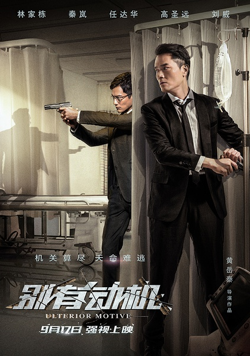
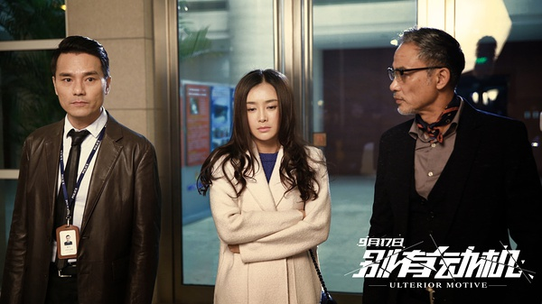

《别有动机》

			

老公的评论：

　　虽然算不上什么大制作，但是这部电影还是有一定的可看性的。

　　电影可看，第一就在于节奏感，节奏紧凑的电影会让我觉得不是那么不耐烦，也就可以把整部不是看完。

　　华语电影的缺憾是“意外”太少，这部电影也是一样，任达华扮演的奸角早就暴露了，可是好像大家都还蒙在鼓里。

　　林家栋一直是我们比较喜欢的演员，对他印象深刻的影视作品第一还是《金装四大才子》中满口“孔曰成仁，孟曰取义”的文征明，另外就是很陈锦鸿一起出演的《上海滩》，虽然他后来也拍了一些还不错的电影，但是都不如这两部电视剧的造型扮演的更有特点。

　　高圣远显得真的很阳光，可惜年纪在这里，估计以后很难见到他的更多作品了。

　　秦岚本来也是有特点的演员，不过在这部电影里显得很刻意、很做作……

　　任达华就不用说了，我觉得他真是个工作狂，出演的电影太多了……

　　因为大部分演员脸熟儿而觉得可看，不喜欢这些主演的就不必花时间了！

老婆的评论：

　　在我看来，这部电影拍的不错，这个案中有案再有案，设计的不错。

　　尤其是真正报仇的人凌锋（高圣远饰）就在身边，而另外一个人在演秦强，这个很厉害，既能转移视线又能更好的掌握信息，太厉害了。

　　要不是有那么个厉害的警察姚杰（林家栋饰）是不是案件就破不了？

　　在看的时候我们猜到了凌峰估计是自我导演了这场绑架案，结合20年前的旧案，我和老公分析这就是复仇案，在还没有结束时也猜到了凌峰才是真正的秦强，这下厉害了吧。

　　叶城（任达华饰）的死，也算是一种交代，符合善恶终有报的文化精神。任达华最近在很多电影里都有他的身影，有意思。

上映年份　2015							
		
http://blog.sina.com.cn/s/blog_52187ba90102wc97.html
