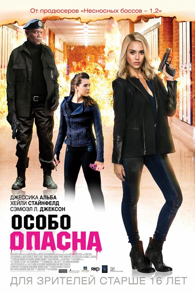

《刺客学妹 Barely Lethal》

			

老公的评论：

　　虽然有特工情节，虽然有追车、枪战、格斗情节，但这部片子依旧是一部青春片而不是一部动作片，至少我是这么认为的。

　　看美国的青春励志片，让我总是不能百分之百接受的是里面的小朋友怎么看都不像十七八岁，看着都有二十多岁了，真的是因为他们长得着急吗？哈哈！

　　女主角看着有点儿胖，怎么也不像个格斗能手，而且，我真的觉得她不怎么好看……

　　看到高中题材的影片，不由得又想起了我的高中年代，哈，现在的美国年轻人也不过如此，我觉得他们玩儿的真不如我们在90年的时候疯，当然，除了大麻之类的毒品……

　　看看，热闹热闹就过去了，爆米花……

老婆的评论：

　　美国的电影里感觉很喜欢拍特工，各种从小就开始培训出来的特工，也或者是我们总是能挑到这类影片。

　　梅根（海莉·斯坦菲尔德饰）从小接受的就是特工培训，更多的是学习如何杀人，但她特别的向往同龄人的高中生活。

　　在一次行动中，她被打落在海里，就伪装死了换了新身份，到了一个新家庭，开始她梦想中的高中生活。

　　现实与她想象的生活不同，她的高中生活变得艰难，再加上曝光了，组织找到她了，维多利亚也来寻仇了。希瑟她的原来组员，也来抢她喜欢的男孩罗杰，真是复杂啊。

　　看的时候，我很感触了，这个组织不太严谨，先后逃了两个组员也不知道。

　　
上映年份　2015							
		
http://blog.sina.com.cn/s/blog_52187ba90102w8b1.html
