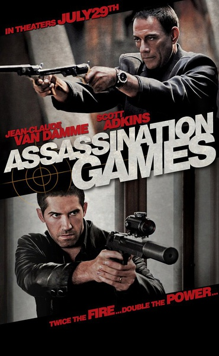
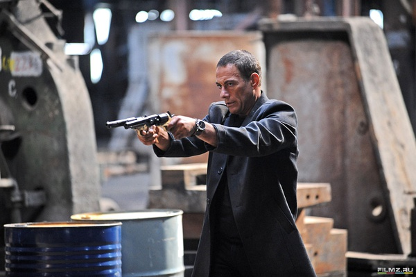

《刺杀游戏 Assassination Games》

			

老公的评论：

　　可能是因为年龄的关系，我还是挺喜欢尚格·云顿的在片中的形象的，无论是正派还是反派。而斯科特·阿金斯则在近几年的《忍者》与《战狼》中给我留下了不错的印象。

　　查了资料得知，这是一部之作成本800万美元的电影，但是整个情节紧凑，毫无拖沓的嫌疑，如果挑一些瑕疵的话，恐怕剧本以及剪辑还有可以更加完善、完美的地方，《双龙会》式的电影，还算好看。

　　说到剪辑上的瑕疵，一是影片中对于弗林特的身份交代的并不是很明确，他为什么会被国际刑警追捕？他之前到底是个警察卧底还是一个黑帮成员？另外就是尚格·云顿所饰演的杀手对自己身份的隐藏太不小心了，如果他是这么一个容易感情用事的人，真不知道怎么当杀手当了这么久……

　　从合作到出卖，又从出卖到合作，说来简单的话题，剧情安排的还算合理，能看，在小成本影片中，算是不错了！

老婆的评论：

　　故事本身很简单，情节也很流畅，结局也是我想要的结果，很痛快。

　　当杀手不容易，得断情绝爱，不然留下威胁了就不好办了。敌人拿Roland
Flint（斯科特·阿金斯饰）的妻子威胁他了，Brazil（尚格·云顿饰）也差点别对方威胁。这两个人一个为了复仇，一个为了赏金，为了杀一个人而较劲，而后合作，Brazil为了钱出卖了Flint了，之后为了其他的两人又合作。

　　在这部电影里，没有绝对的正义，只是一个复仇，而主人公们复仇成功这个让我很高兴，因为被杀的那些人也都是坏人。

　　总体来说，这是一部好看的电影，值得一看。

上映年份　2011							
		
http://blog.sina.com.cn/s/blog_52187ba90102w8av.html
