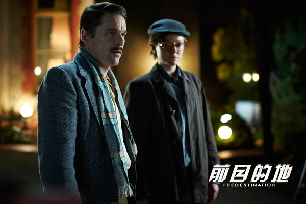

《前目的地　Predestination》

			

老公的评论：

　　相当古怪玄奥的一部电影，不得不说，小说原创作者的视角是很另类的。

　　电影的开始部分不是很有意思，以至于我搞不懂为什么要让主人公和一个变性人在酒吧的谈话占用这么长的篇幅，我一直在猜测着变性人与“爆破者”之间的联系，没想到……

　　看完之后，觉得这部电影的哲学观是一个悖论：一个弃婴，长大之后成为女人，因为某种原因女人做了变性手术成为了一个男性，这个男性穿越回到了过去和以前的自己（女性）生了一个孩子，而这个孩子又被男性从更远的未来穿越回去抱走送到了孤儿院成为了那个弃婴……，不得不说，人类的想象力真的是很丰富，不怕做不到，就怕想不到！

　　当做对某类科幻题材的了解去观看，还是会有一些惊奇的，但是整部电影拍摄的一般，最多算中等偏上一点的水准。

老婆的评论：

　　看这部电影，费了我老鼻子劲了，其实到最后我也是一知半解，只是难得啊，看来对于这种有技术性的科幻，我还是不太懂额。

　　时间特工这一个工作还是挺有意思的，但是要像本片的主角伊桑·霍克这样的时间特工，其实是一个非常悲剧的人物。

　　其实到后来，我才发现，伊桑·霍克就是约翰，约翰是简，而约翰和简又生了简，然后伊桑·霍克把简送回的过去，这个多复杂的圈圈，无论是否符合科学，是否是悖论，我是无法说清楚的。

　　而伊桑·霍克一直想回到过去阻止的“闪灭炸弹客”，也应该是要阻止自己吧，多奇怪的逻辑。

　　从电影本身来说，我觉得这部电影不看好。当然如果你理解作者的想表达的，或许和我感觉不太同吧。

上映年份 2014							
		
http://blog.sina.com.cn/s/blog_52187ba90102vtbg.html
