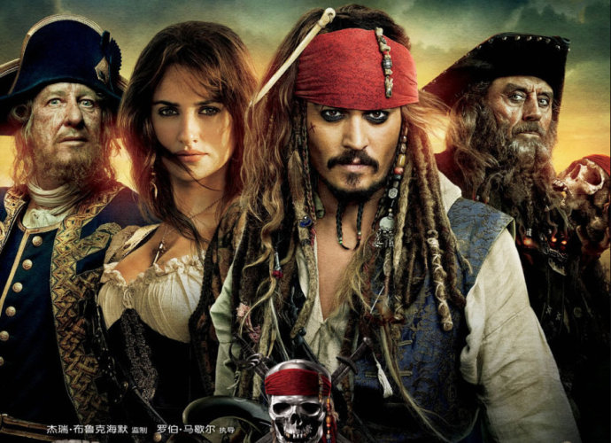
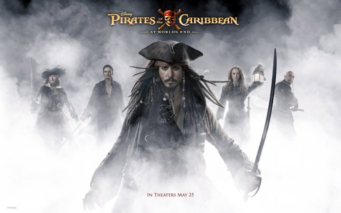

《加勒比海盗：惊涛怪浪》

			

老公的评论：

　　这部《加勒比海盗》拍的太像通话了，完全没有了之前的风采。
 
　　处于善意，我把我看这部电影几乎快要睡着的原因是我太困了，但是很少有所谓的“大片”让我有犯困的感觉了。
 

　　或许这部电影是在走目前的文化路线吧，没有什么因果关系，编剧们想到哪编到哪，我完全没有闹懂之前安排杰克船长遇到英国国王或者是那个牧师与美人鱼和电影的主题到底有什么联系，但导演这么拍了，我也就只能这么看了。
 

　　从这部续作来看，我觉得《加勒比海盗》很难再短时间里再引起观众的热情了，一个很好的题材就这么被糟践了。对比刚刚看过的《速度与激情》，我觉得是编剧们把自己的路给写窄了，其实这个系列只要坚持杰克船长的冒险之旅就很好，电影中多演一些杰克遇到的怪物、怪事，我觉得反而更简单。
 
　　现在呢，因为编剧想要复杂而把整个故事复杂化，什么英国海军、西班牙海军，太过复杂，反而失去了焦点，失去了卖点。
 
　　想靠一个一成不变的演员带动起一部电影看来真的有点不现实！

老婆的评论：
 
　　这部影片没有前三部有意思，而且时间太长，节奏太拖拉啦。总的来说，不好看！
 
　　额，更重要的一点，这部影片的主演约翰尼·德普表现的不好，让我有点不喜欢这个杰克海盗这一角色了。
 
　　从情节方面看，这部影片的情节不精彩，前面浪费太多的时间做铺垫，真正精彩部分又太少了。
 
　　从特技方面看，其实没有什么真正的特技效果，就一场美人鱼与海盗们的对杀，感觉有点效果。其他的都趋近平常。
 
　　杰克、安杰丽卡与黑胡子之间在去找不老泉的一路，一直在互相利用，欺骗，让我觉得海盗应该是这样的。黑胡子的魔法刀不错。
 
上映年份：2011年							
		
http://blog.sina.com.cn/s/blog_52187ba90100y6t9.html
