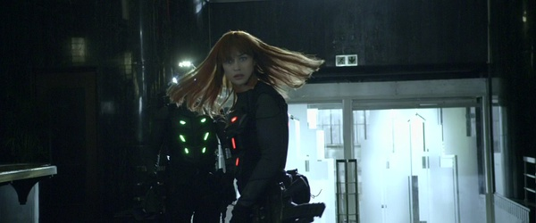

《动力 Momentum》

			

老公的评论：

　　欧嘉·柯瑞兰寇不算很漂亮，但是很有特点，让人看过之后就会记住她，我觉得这样的演员比单纯的花瓶会更有市场。从她出演的电影来看，和丹尼尔·克莱格，汤姆·克鲁斯都配过戏，算是一个一线明星了，出演这种小成本电影也算是让我们这些影迷可以多看她几次吧。

　　《动力》的开篇投入感很强，一个银行抢劫案的执行过程很容易牵着观众的思绪随着剧情动起来。稍事铺垫之后，故事开始逐步推进，随着银行劫案的同伙被杀掉，女主人公的身份、背景等也逐步浮出了水面。

　　故事的大背景还是野心的政客试图为了政治和军火商勾结发动战争，虽然老套，但是电影并没有在这方面浪费笔墨，整体的节奏还是快速的，另外在打斗的同时也加入了一些高智慧的策划，有一些看点。

　　虽然不能算最好的影片，但是可看！我为什么觉得这种电影都适合拍成连续剧……　　

老婆的评论：

　　这部电影，我挺喜欢的。

　　情节紧凑，从开头Alex他们几个人抢劫银行开始，他们成功的抢到了钻石和驱动器，Alex不小心露出了真面貌，一环扣一环，真的很让人紧张。

　　酒店里领头的华盛顿是参议员派出的杀手，他们一定要抢回驱动器，因为这里面有一个很强大的阴谋，这场追杀到后面只剩Alex了。

　　有点时候很奇怪Alex在杀人时，怎么不把人杀彻底了，后来还把自己送到华盛顿手里，让他折腾？结局却明白，这一切都是她的安排，我真的很想说，Alex太厉害了。

最近他演了很多的电影
上映年份　2015							
		
http://blog.sina.com.cn/s/blog_52187ba90102wfjm.html
