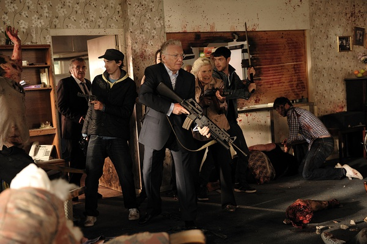

《劫匪与僵尸 Cockneys Versus Zombies》

			

老公的评论
 
　　其实我们看的英国电影并不多，甚至英剧也不多，主要还是觉得文化氛围更难融入吧，看的时候有很多典故不明白。
 

　　不过好像这部《劫匪与僵尸》并没有什么典故了，甚至如果夸张一点说，都可以认为它没有什么情节，就是打僵尸嘛，至于劫匪，其实并没有体现出什么。
 

　　主人公因为要保住一家养老院而需要抢银行，因为抢银行所以有枪，因为有枪所以当僵尸出现的时候有能力对抗……，最后一起逃上船，驶向不知名的远方……，就是这么一个简单的故事，拍的挺热闹。
 

　　看到这样的电影被划分到恐怖片的类型里，我觉得还是不太应该，这就是一部喜剧片吧，没什么恐怖的地方。而且这个故事里的僵尸有点太憨直了，呵呵。
 
　　有个地方没看懂——两派自己打架的僵尸是球迷吗？感觉一方穿的像西汉姆的队服。

老婆的评论：
 
　　这部电影看着看着我就有点想睡觉的感觉，整部电影我是在一会睡一会醒了看几眼又睡又看几眼的度过的。
 

　　这部电影给我的最大感觉是这些人真的很傻，我想快赶上僵尸的智商了。不过，我还是觉得主人公为了老人家去当劫匪这事虽同情他们，但并不提倡这么干。
 

　　关于僵尸的话题，我和老公经常讨论，要是我们楼下有僵尸了怎么办？不要紧，网上购物让快递公司送好了。要是真的要和僵尸打怎么办？打不过，只好自己也扮成僵尸，要是僵尸是闻味道可就不好办了。
 
　　结尾我是看到了的，能逃出来不错了，不过他们又能逃到哪里呢？
 
上映年份 2011							
		
http://blog.sina.com.cn/s/blog_52187ba901019wiy.html
