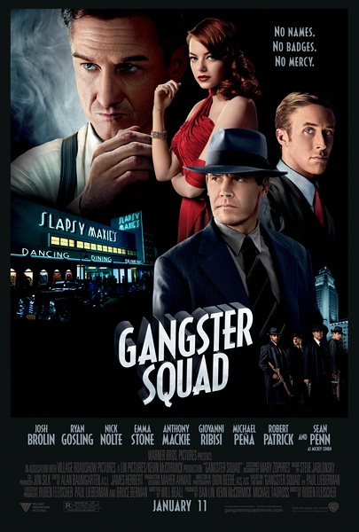
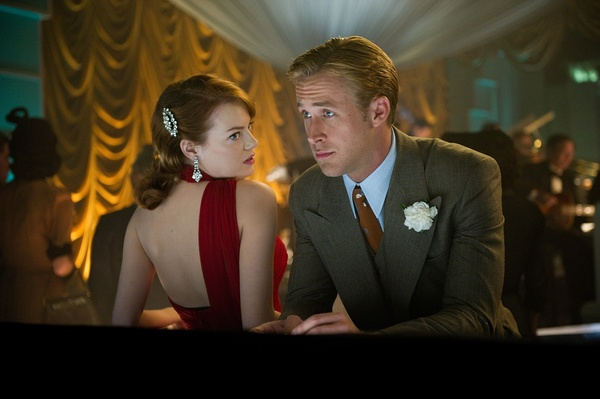
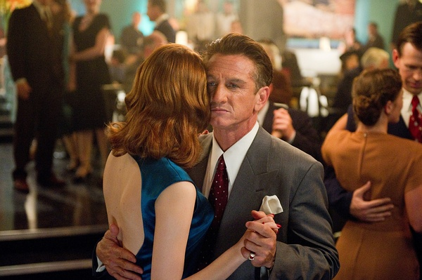
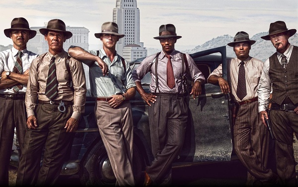

《匪帮传奇 Gangster Squad》

			

老公的评论：

　　其实我一直不喜欢根据真人真事改编的电影，因为这样因为受所谓的“真实”的限制，会少了很多的变化与创造，不过这部电影讲的是四十年代的历史，也就无所谓真人不真人了，历史嘛，就是被人纪录下来的东西，至于真假，可能是真的，但未必是全部。

　　和很多寻求正义的电影不同，这部电影反映出来的内容是典型的以暴制暴，以杀止杀的理念，政府没有能力公开对付罪犯，就暗中支持了一伙人黑吃黑，也算是一种典型的美国逻辑了——为了目的，不择手段。

　　我一直疑惑“正义的匪帮”被识破那次为什么不能拿走一部分钱呢，那就不会被发现了，也不会累得情报员惨死了，有家小的人实在不适合参与这种玩儿命的行动。

　　本来，如果不是考虑到“真实性”，我想这部片子还是可以拍的更酷，更搞笑，观赏性可以更强一点，现在看来，整体感觉有些平，不是每时每刻都能抓住观看的我。

　　可看，有些怀旧……

老婆的评论：

　　说实话，写影评时我忽然想不起这部电影讲什么了。静下心，想想，这是一部怀旧电影，是发生在1949年的故事。

　　看看，电影能让我们学会很多的东西，如果你认真看了的话。

　　在很多人认为，美国是一个理想的法制国家的时候，我保留自己的看法，我觉得在这个世界上，每个国家的法律是对老百姓制定的，而特权者是除外的。就算美国也是如此，只是比较起来美国的法律相对完整，在这部电影里，我们也看到过去的美国并非如此，这也是一代代人牺牲才能走到现在这一步。

　　扫黑小组的成立，正是因为那时洛杉矶大部分的官员、法官和警察被黑社会老大米奇收买，而且没人敢指正米奇，他们靠法律是无法对付米奇，只能黑着干，约翰是扫黑小组的头，他带领着5个手下，在不被官方认可的情况下，逐一扫荡米奇的势力，最终格瑞斯的帮助下，把米奇关起来了。

　　很遗憾，扫黑小组的情报人员康韦尔和神枪手麦克斯都牺牲了。这就是代价！
　　

上映年份 2013							
		
http://blog.sina.com.cn/s/blog_52187ba90102vpe7.html
